# Multihazard resilience and economic loss evaluation method for  cable-stayed bridges under the combined effects of scour and earthquakes  

Guo-Yi Wu   a , Chun-Guang Liu   a , , Zhi-Qian Dong   a , , Hui-Dong Liu   c , Faizan Ali   d  

a  State Key Laboratory of Coastal and Offshore Engineering, Dalian University of Technology, Dalian 116024, China  b  Guangdong Provincial Key Laboratory of Intelligent Disaster Prevention and Emergency Technologies for Urban Lifeline Engineering, Dongguan 523808, China  c  China Construction Third Engineering Bureau Group Co., LTD, Urumqi 830000, China  d  Institut de Ci encia de Materials de Barcelona (ICMAB-CSIC), Campus UAB, Bellaterra 08193, Spain  

# A R T I C L E  I N F O  

# A B S T R A C T  

Cable-stayed bridges (CSBs) commonly experience scour-induced foundation issues during their service life,  impacting both structural seismic resilience and economic losses. Nonetheless, these aspects remain inadequately  addressed in existing seismic codes. This paper presents a comprehensive probabilistic multihazard fragility,  resilience, and economic loss evaluation method for CSBs influenced by scour and earthquakes. Numerical  models with various scour depths considering epistemic uncertainties in loads, structural properties, and soil  conditions are first established using the Latin-hypercube sampling (LHS) method. Incremental dynamic analyses  (IDAs) are then conducted on these models in cases with near-fault and far-field bidirectional ground motions,  yielding probabilistic multihazard demand models and component- and system-level multihazard fragility sur­ faces for diverse limit states. Subsequently, resilience and economic losses are comparatively evaluated by  integrating damage probabilities with corresponding uncertain functional recovery functions. Eventually, a rapid  bridge traffic capacity evaluation method based on the critical traffic capacity surface concept is devised to  effectively assess CSB open patterns under various peak ground accelerations (PGAs), scour depths, and repair  times. The numerical results show apparent shifts in the nonmonotonic seismic fragility, resilience, and economic  loss of the case CSB due to scour effects, with the rates of change reaching   $31.4~\%$  ,   $34\;\%,$  , and   $24.8\ \%$  , respec­ tively, associated with a critical scour depth of  $_{12\;\mathrm{m}}$   at  $\mathbf{IM}=0.8\;\mathrm{g}$  . The developed analysis framework provides a  reference for the life-cycle design and maintenance of CSBs affected by multihazard scour and earthquakes.  

Keywords:  Cable-stayed bridges  Seismic hazard  Scour hazard  Multihazard fragility analysis  Resilience  Economic loss  Traffic capacity evaluation  

# 1. Introduction  

As integral components of transportation networks, cable-stayed  bridges (CSBs) benefit regional economies by virtue of their stability,  aesthetic appeal, and efficient material utilization. However, CSBs in  high seismic regions, if damaged by severe earthquakes, can signifi­ cantly impact regional traffic systems and functional recovery processes  [1 – 3] . Moreover, CSBs situated in rivers with swift currents are prone to  scour-induced foundation issues, potentially reducing lateral pile stiff­ ness and affecting seismic performance  [4] . To date, little attention has  been given to the scour hazard in academic research and design codes.  Moreover, the probability of structural failure increases due to the risk of  multiple hazards  [5] .  

From 1966 to 2005, approximately 1502 bridge failures occurred in  America. Among these failures, approximately   $58\ \%$   and   $3.4~\%$   were  caused by foundation scour and seismic hazards, respectively  [6] . In  addition, Zha et al.  [7]  noted a maximum local scour depth around  foundations exceeding   $_{16\,\mathrm{m}}$  . These findings underscore that foundation  scour is a primary cause of bridge failures and that bridges are prone to  multiple hazards during their service life. Some studies have examined  the multihazard performance of scoured pile-foundation-supported  bridges affected by earthquakes. Alipour et al.  [8]  refined load and  resistance parameters for reinforced concrete bridge design in the  context of scour and earthquakes through reliability analysis. Wang  et al.  [9]  developed a fragility surface technique to quantify the effects of  scour on the seismic performance of pile-supported bridges. Guo et al.  [10]  conducted time-dependent seismic fragility analyses of scoured  bridges over their service life, addressing both scour hazard uncertainty  and its temporal patterns. Wang et al.  [11]  introduced a risk-aligned  approach to adjust load coefficients for the design of reinforced  

concrete bridges exposed to scour and earthquakes. These studies  consistently indicated that local scour holes could diminish the lateral  stiffness of foundations, thereby affecting the seismic performance of  bridges. Disregarding scour hazard has led to inaccurate estimations of  structural seismic behavior  [12] . However, in prior research, the seismic  performance of scoured simply supported bridges was primarily evalu­ ated, with a limited focus on CSBs  [13 – 15] . Wei et al.  [16]  analyzed the  vulnerability of scoured cross-sea CSBs, revealing that various scour  depths can have favorable or unfavorable impacts on seismic fragilities  at both the component and system levels. Given the potential for  low-probability, high-consequence multihazard events to alter struc­ tural behavior at various points in time, further investigation is essential  to systematically assess the multihazard performance of CSBs during  concurrent earthquake-scour hazards.  

Seismic fragility analysis is a prevalent tool for evaluating the  structural performance of CSBs. Akhoondzade et al.  [17]  investigated  component- and system-level CSB fragilities through the IDA frame­ work. Pang et al.  [18]  proposed fragility curves for single-pylon CSBs to  investigate the impact of uncertainties in fragility functions. However,  although fragility analysis can be efficiently used to assess seismic  damage, it lacks a direct link to postearthquake recovery variables, such  as the functional recovery profile, recovery time, repair budget, and  indirect economic loss. For instance, the rehabilitation of the extensively  damaged Zhaobaoshan CSB in China continued for almost one year to  regain full functionality. The restoration process included cable force  calibration, main tower strengthening, bridge deck repavement, and  reinforcement of additional components. Hence, the integration of a  resilience index that closely aligns with the overall functional recovery  and economic implications is essential in civil engineering. This  approach aids decision-making by providing a quantified assessment of  socioeconomic impacts on compromised transportation infrastructure to  guide postevent restoration efforts  [19 – 21] . Resilience evaluation has  gained prominence for individual bridges and bridge networks  [22,23] Sandhya et al.  [24]  employed a multiobjective optimization algorithm  to optimize retrofit plans based on multihazard resilience and retrofit  costs. Qian et al.  [25]  evaluated the lifetime resilience of steel-SMA  reinforced concrete bridges, considering stochastic ground motions  and functionality decline. Badroddin et al.  [26]  developed a probabi­ listic resilience evaluation framework for simple-supported bridges in  cases with earthquakes, scour, and environmental degradation. More­ over, Pang et al.  [27]  quantified postearthquake functionality loss via  reliability analysis and studied the seismic resilience of CSBs, consid­ ering cable corrosion-related degradation. The resilience of CSBs, as  critical infrastructure components, is vital for assessing posthazard  performance in transportation systems. Although some relevant studies  have been conducted, research on the seismic resilience of CSBs  considering scour hazards remains limited. Due to significant differences  in hazard probability and structural fragility between multihazard and  single-hazard cases, the results of the existing seismic resilience assess­ ment methods cannot be used to accurately evaluate the performance of  a CSB in the context of both earthquakes and scour hazards. Therefore, it  is necessary to develop a resilience assessment method for cable-stayed  bridges influenced by multiple hazards.  

This study fills critical knowledge gaps by establishing a compre­ hensive probabilistic multihazard fragility, resilience, and economic loss  framework for CSBs considering the combined effects of scour and  earthquake hazards. These factors are investigated across various scour  hazard intensities (i.e., scour depths) and for both near-fault and far-  field ground motions, accounting for uncertainties in functional recov­ ery processes. Furthermore, a rapid bridge traffic capacity evaluation  method is proposed for CSBs, and various PGAs, scour depths, and repair  times are explored.  

# 2. Multihazard fragility, resilience, and economic loss  evaluation framework  

Although some studies have effectively conducted analytical fragility  analyses of CSBs for individual earthquake hazards, analytical ap­ proaches for evaluating the fragility, resilience, and economic loss of  CSBs in combined scour-earthquake hazard scenarios remain notably  scarce. In this study, a comprehensive framework is developed for  assessing the multihazard fragility, resilience, and economic losses of  CSBs subjected to scour and earthquakes, which can aid in investigating  the effect of earthquake-scour hazards on CSB performance. The mul­ tihazard fragility analysis conducted here specifically pertains to seismic  fragility analysis, taking into account the scour erosion around pile  foundations. This multihazard analysis differs from conventional  seismic assessments of CSB performance, encompassing novel load  models, analysis methods, performance indicators, and evaluation  techniques. For seismic and scour hazards, scour hazard intensities are  simply considered and modeled as various scour depths, incorporating  corresponding variations in structural stiffness and posthazard perfor­ mance. Regarding the analysis method, scour effects are captured  through structural stiffness changes, and ground motions are applied as  accelerations to the base of pile foundations. Various performance in­ dicators are utilized for individual components, such as the pylon top  drift rate, pier section curvature ductility, bearing shear strain, and cable  strain ratio. Using these indicators, multihazard demand models are  established considering the combined effects of two hazards. The eval­ uation method involves concurrent consideration of seismic and scour  hazard intensities, and structural failure probability surfaces, the sub­ sequent resilience trends, and economic loss evaluation are explored  under various load combinations. Thus, the framework involves seven  primary steps: (1) establishing uncertain numerical models; (2) applying  IDA to these models; (3) deriving probabilistic multihazard demand  models; (4) conducting multihazard fragility analysis; (5) obtaining  posthazard functional recovery surfaces; (6) estimating resilience  values; and (7) performing economic loss assessments. This section  elaborates on the fundamental concepts and principles of each step to  enhance the comprehension of the overall approach.  

# 2.1. Step 1: Numerical model establishment considering uncertainty  

Model uncertainties significantly influence the limit states used to  evaluate the multihazard performance of CSBs. To address this issue,  near-random model parameters are generated via LHS, and stochasti­ cally assigned to loads, structural geometries, materials, and soil prop­ erties in dynamic time history analyses  [18] . Furthermore, by  eliminating soil springs, numerical models with flexible foundations and  diverse scour depths can be established. Eigenvalue analysis is per­ formed based on natural vibration modes to validate the numerical  models of CSBs.  

2.2. Step 2: Incremental dynamic analysis  

To explore the multihazard performance of scoured CSBs, selected  ground motions are scaled with various intensity measures   $(I M_{s})$   to  provide reliable response data for developing probabilistic multihazard  demand models.  

# 2.3. Step 3: Probabilistic multihazard demand model  

The probabilistic multihazard demand model effectively connects  the structural demand measure   $(S_{D})$   and   $I M_{s}$    via dynamic analyses and  statistical regression. As noted in  [28] , 1st- or 2nd-order regression  models aptly relate structural responses to input load intensities. For  simplicity and efficacy, a 1st-order multiple linear regression model is  adopted in this study. This probabilistic multihazard demand model is  expressed as  [29] :  

$$
\ln(S_{D})=p_{0}+p_{1}\,\ln\bigl(I M_{e q}\bigr)+p_{2}\,\ln\bigl(I M_{s c o u r}\bigr)
$$

where  $p_{0},p_{1}$    and  $p_{2}$    are log-linear regression coefficients.  $I M_{e q}$    and  $I M_{s c o u r}$  denote earthquake and scour intensity measures, respectively.   $\sigma_{D\mid I M_{e q},I M_{s c o u r}}$    can be computed through the residual sum of squares in the  regression process:  

$$
\sigma_{D\left|I M_{e q},I M_{s c o u r}\right.}\cong\sqrt{\frac{\sum_{i=1}^{n}[\,\ln(D_{i})-\,\ln(S_{D})]^{2}}{n-2}}
$$

where   $D_{i}$  indicates the peak structural response for the  i -th ground  motion and  $n$    is the total number of simulation samples.  

# 2.4. Step 4: Multihazard fragility analysis  

Considering the interplay between structural demand and capacity   $(S_{C})$  , fragility analysis can be used to determine the conditional proba­ bility of surpassing a designated damage state (DS) at a specific  $I M$  . The  conditional probability is commonly represented by a lognormal prob­ ability distribution  [30] :  

$$
P\left[S_{D}\ge S_{C}|I M\right]=\Phi\left[\frac{\ln(S_{D})-\;\ln(S_{C})}{\sqrt{\sigma_{D|I M}^{2}+\sigma_{C}^{2}}}\right]
$$

where   $\Phi[\cdot]$   denotes the standard normal cumulative distribution func­ tion,   $\sigma_{D|I M}$    and  $\sigma_{C}$    signify the logarithmic standard deviations of struc­ tural demand and capacity, respectively.  

However, single-hazard fragility curves account for only one   $I M$  whereas multihazard fragility analysis involves two distinct  IM s:   $I M_{1}$  and   $I M_{2}$  . To address this limitation and span diverse engineering sce­ narios, the fragility surface approach is employed here. After desig­ nating   $I M_{e q}$    and   $I M_{s c o u r}$  as earthquake and scour intensity measures,  respectively,  Eq. (3)  is accordingly revised as:  

$$
P\big[S_{D}\geq S_{C}\big|I M_{e q},I M_{s c o u r}\big]=\Phi\left[\frac{\ln(S_{D})-\ln(S_{C})}{\sqrt{\sigma_{D}^{2}\big|I M_{e q},I M_{s c o u r}+\sigma_{C}^{2}}}\right]
$$

where  $\sigma_{D|I M_{e q},I M_{s c o u r}}$  denotes the logarithmic standard deviation of  $S_{D}$    for  various  $I M$  -pairs.  

Based on  Eq. (1) - (4) , the multihazard fragility of diverse components  can be assessed. To evaluate the multihazard performance of CSB sys­ tems, which are presumed to act as a tandem system when subjected to  multiple hazards, the bounds of system fragility can be estimated  through first-order reliability theory. In this approach, complete corre­ lation or no correlation among components is assumed  [30] :  

$$
\operatorname*{max}_{j=1}^{n}\Big[P\big(F_{j}\big)\Big]\leq P\big(F_{s y s}\big)\leq1-\operatorname*{max}_{j=1}^{n}\Big[1-P\big(F_{j}\big)\Big]
$$

where   $P(F_{j})$   and   $P(F_{s y s})$   denote the damage probabilities of the   $j$  -th  component and CSB system, respectively. For brevity, only the upper  bound of system fragility is presented below and utilized in resilience  and economic loss evaluation. The occurrence probability of the  $k$  -th DS  for the  $j\cdot$  -th component or CSB system under a specific  IM-pair  can be  calculated as follows:  

$$
P_{(\cdot),k}=\left\{P_{(\cdot),k+1}-P_{(\cdot),k}\ 1\leq k\leq3\right.
$$

where   $P_{(\cdot),k}$  represents the fragility of a component  $(P_{j,k})$   or system   $(P_{s y s,k})$    at the  $k$  -th DS.  

# 2.5. Step 5: Posthazard functional recovery process  

Resilience   $(R)$   serves as a performance metric for measuring  posthazard structural capacity to sustain functionality and restore  normalcy  [31] . The posthazard time-varying functional recovery pro­ cess and total structural system resilience are illustrated in  Fig. 1 . Spe­ cifically, CSBs face multiple hazards (e.g., earthquakes and scour) that  can swiftly reduce their functionality to various levels over their service  life. Following rehabilitation, CSB functionality gradually recovers over  time, eventually reaching the desired value upon completion of the  rehabilitation action. Furthermore, the traffic capacity of CSBs relies on  their functionality, quantified between 0 and 1. A functionality of 1  indicates an intact bridge with unchanged traffic capacity, while 0 sig­ nifies CSB collapse and complete loss of traffic capacity. Note that  $Q(t)$   in  Fig. 1  represents the posthazard time-varying expected functionality of  CSB systems,   $Q_{r}$  represents posthazard residual functionality,   $Q_{e}$  in­   dicates the expected functionality at   $t_{o}+\Delta t$    and is set to 1  $,t_{o},\Delta t$  , and   $t_{s}$  denote the onset time of multiple disasters, investigated time frame and  restoration initiation time.  

The functional recovery over time varies with various DSs of the CSB  system. To quantify the functional recovery for each DS, a prevalent  approach involving a normal cumulative distribution function, derived  from postearthquake surveys of highway bridges, is adopted  [32] :  

$$
Q_{k}(t)=\frac{1}{\beta_{k}\sqrt{2\pi}}\int_{-\infty}^{t}\exp{\left[-\frac{\left(t-\mu_{k}\cdot A_{t}\right)^{2}}{2\beta_{k}^{2}}\right]}\,d\tau
$$

where   $Q_{k}(t)$   represents the time-varying functionality of CSB systems  associated with the   $k$  -th DS;   $\mu_{k}$  and   $\beta_{k}$  denote the mean and standard  deviation of functional recovery time for the   $k$  -th DS, respectively; and   $A_{t}$    is the amplification factor of   $\mu_{k}$    associated with underwater repairs. In  engineering practice, underwater inspection and repair are necessary for  damaged components beneath the still water level. The overall time-  varying expected functionality of CSB systems can be determined by  integrating functional recovery curves with the corresponding occur­ rence probabilities of four DSs, as follows:  

$$
Q(t)=\left\{\begin{array}{c c}{\displaystyle\sum_{k=1}^{4}Q_{k}(t_{o}){\cdot}P_{\mathrm{sys},k}^{\prime},}&{t_{o}\leq t\leq t_{s}}\\ {\,}\\ {\displaystyle\sum_{k=1}^{4}Q_{k}\left(t-t_{s}\right){\cdot}P_{\mathrm{sys},k},}&{t_{s}\leq t\leq t_{o}+\varDelta t}\\ {\,}\\ {\displaystyle\sum_{k=1}^{4}Q_{k}\left(t_{o}+\varDelta t\right){\cdot}P_{\mathrm{sys},k}^{\prime},}&{t_{o}+\varDelta t<t}\end{array}\right.
$$

The functional recovery curve is employed to delineate the degree of  loss and recovery process of CSB functionality under diverse intensity  hazards. This facilitates the determination of subsequent structural  resilience, traffic capacity, and indirect economic losses of CSBs at  various recovery times.  

# 2.6. Step 6: Resilience evaluation  

Resilience is a multidimensional research field encompassing various  aspects. However, this study specifically focuses on quantifying the  resilience of a singular engineering structure, considering the post-  disaster loss degree and recovery time, while omitting the examina­ tion of resilience in social, economic, and cultural aspects. It is crucial to  note that, in this context, resilience represents the mean functionality  level within the investigated posthazard timeframe. Higher resilience  values signify effective sustainability and recovery of functionality,  while lower values indicate a substantial decline in functionality and a  slow recovery process for CSBs. The resilience of CSBs can be obtained  from functional recovery curves via the standard method  [33] :  

$$
R\left(I M_{e q},I M_{s c o u r}\right)=\frac{1}{\varDelta t}\int_{t_{o}}^{t_{o}+\varDelta t}Q(t)d t
$$

where   $\left[t_{o},t_{o}+\Delta t\right]$   denotes the temporal scope of the resilience measure.  

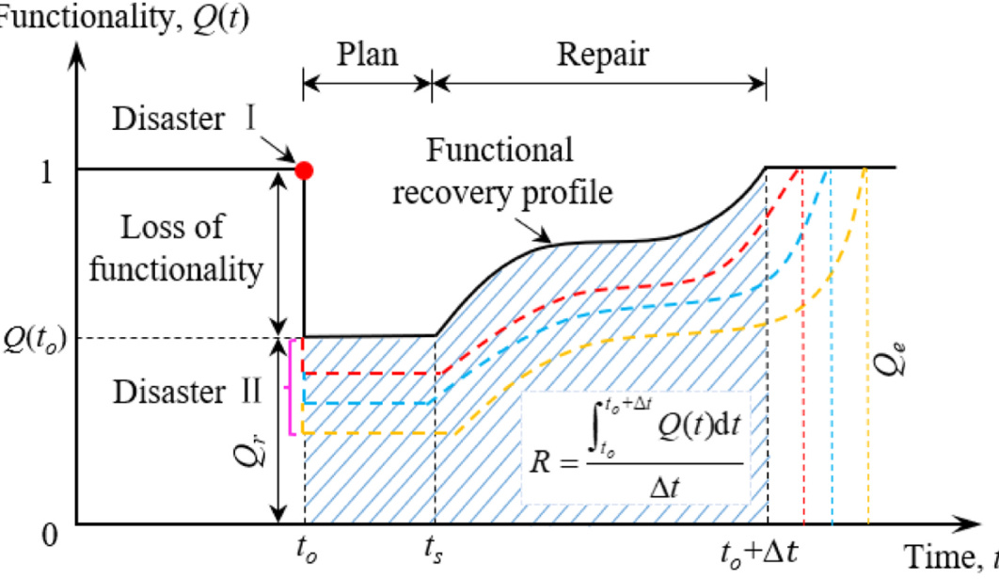  
Fig. 1.  Illustration of the resilience index and functional recovery of CSBs in cases with multiple hazards.  

respectively. These factors  $r_{t}$  and  $r_{c}$  reflect the varying underwater repair  abilities associated with different repair schemes.  

2.7. Step 7: Economic loss evaluation  

As the functionality of damaged CSBs decreases, there is a conse­ quential restriction in traffic volume. Some vehicles proceed at reduced  speeds, while others divert to alternate routes, resulting in indirect  losses through elongated travel time and distances. Residual operational  capacity can be gauged based on the number of recovered lanes. To  calculate indirect losses, the passage rate   $(R_{p}(t))$  , representing the ratio  

The economic losses of CSBs include direct repair and indirect losses  due to reduced driving speeds and detours. Direct repair losses, per­ taining to the repair expenses of damaged bridges, are assumed to be  proportional to component rebuild costs and are commonly estimated  using component fragility. The cost escalation factor for underwater  repairs is considered. Thus, direct repair losses can be computed as  [34]  

$$
\begin{array}{r l}&{C_{D R L}=c_{e}\cdot\displaystyle\sum_{m_{e}=1}^{n_{e}}\displaystyle\sum_{k=1}^{4}l r_{k}\cdot A_{m_{e}}\cdot P_{m_{e},k}+c_{p}\cdot\displaystyle\sum_{m_{p}=1}^{n_{p}}\displaystyle\sum_{k=1}^{4}l r_{k}\cdot A_{m_{p}}\cdot P_{m_{p},k}+c_{i}\cdot\displaystyle\sum_{m_{i}=1}^{n_{i}}\sum_{k=1}^{4}l r_{k}\cdot A_{m_{i}}\cdot A_{c}\cdot P_{m_{i},k}}\\ &{+c_{b}\cdot\displaystyle\sum_{m_{b}=1}^{n_{b}}\displaystyle\sum_{k=1}^{4}l r_{k}\cdot P_{m_{b},k}+c_{c}\cdot\displaystyle\sum_{m_{c}=1}^{n_{c}}\displaystyle\sum_{k=1}^{4}l r_{k}\cdot P_{m_{c},k}}\end{array}
$$

of traffic utilizing the damaged bridge to that using the unscoured CSB,  is defined as a mapping of the CSB functionality ranges, as listed in   Table 1 [36,37] .  

where  $l r_{k}$  denotes the component loss ratio for slight, moderate, exten­   sive, and complete damage states, set as 0.1, 0.3, 0.75, and 1, respec­ tively  [35] ;  $c_{e},c_{p}$    and  $c_{i}$    are rebuild costs per square meter for pier, pylon,  and pile elements, respectively   $(\mathrm{USD}/\mathfrak{m}^{2})$  );  $c_{b}$  and  $c_{c}$  denote rebuild costs      for each bearing and cable, respectively (USD);  $A_{m_{e}}$  ,  $A_{m_{p}}$    and  $A_{m_{i}}$  are the  cross-sectional areas of the  $m_{e}$  -th pier, the  $m_{p}$  -th pylon, and the  $m_{i}$  -th pile  element, respectively;  $A_{c}$    is the cost escalation factor for the  $m_{i}$  -th pile  element, considering generally submerged damaged pile elements;  $\boldsymbol{P}_{m_{e},k}^{'},$  

The daily driving cost for cars and trucks due to an added detour  distance can be calculated as follows:  

$$
C_{R}(t)=\bigg[c_{r,c a r}\bigg(1-\frac{T}{100}\bigg)+c_{r,r u c k}\frac{T}{100}\bigg]\cdot L_{d}\cdot\big[1-R_{p}(t)\big]\cdot M D T
$$

where  $c_{r,c a r}$    and  $c_{r,t r u c k}$    are the driving costs per unit distance for cars and  trucks, respectively   $(\mathrm{USD}/\mathrm{km})$  ;   $L_{d}$  denotes the detour distance   $(\mathbf{km})$  MDT  signifies the original mean daily traffic volume; and  $T$    denotes the  daily traffic occupancy for trucks. The daily temporal expense for car  and truck drivers due to extended travel time from slow driving and  detours can be computed as follows:  

$P_{m_{p},k}^{\prime},P_{m_{i},k}^{\prime},P_{m_{b},k}^{\prime}$  and   $P_{m_{c},k}^{'}$  represent the occurrence probabilities of the  $k$  k    -th DS for the   $m_{e}$  -th pier, the   $m_{p}$  -th pylon, the  $m_{i}$  -th pile element, the   $m_{b}$  -th bearing, and the   $m_{c}$  -th cable components at a given IM, respec­ tively; and   $n_{e},\,n_{p},\,n_{i},\,n_{b}$    and   $n_{c}$  denote total numbers of damaged pier,  pylon, pile elements, bearing, and cable components, respectively.  Considering the amplification of repair time and cost for submerged  components, the escalation factors, denoted as  $A_{t}$    and  $A_{c}$  , are assumed to  be proportional to the damaged percentage of the submerged elements,  i.e.,  $A_{t}=r_{t}^{d_{m_{i}}/H_{l}}$    and  $A_{c}\,=r_{c}^{~d_{m_{i}}/H_{l}}$  , where  $r_{t}$  and  $r_{c}$  (assumed to be 2 and 3,      respectively) denote the growth rates of underwater repair time and  cost.   $H_{l}$  represents the total length of a submerged pile, and   $d_{m_{i}}$  is the  submersion depth of the   $m_{i}$  -th damaged pile element. Notably, escala­ tion factors remain at 1 when submerged piles are undamaged. As   $d_{m_{i}}$  rises to   $H_{l};$  , both   $A_{t}$  and   $A_{c}$    increase to maximum values of   $r_{t}$    and   $r_{c}$  

<td><table  border="1"><thead><tr><td><b>DSs</b></td><td><b>Functionality ranges</b></td><td><b>Open patterns</b></td><td><b> Passage rates</b></td></tr></thead><tbody><tr><td> No damage</td><td>90-100 %</td><td>Immediate access</td><td>100 %</td></tr><tr><td> Slight </td><td>60-90 %</td><td>Weight restriction</td><td>75 %</td></tr><tr><td>Moderate</td><td>40-60 %</td><td>Half-lane opening</td><td>50 %</td></tr><tr><td>Extensive</td><td>10-40 %</td><td>Emergency access only</td><td>25 % </td></tr><tr><td>Complete</td><td>0-10 %</td><td>Bridge closure</td><td>0 %</td></tr></tbody></table></td>  
$$
\begin{array}{l}{{C_{T}}(t)=\left[{{c_{s,c a r}}{o_{c}}\left({1-\frac{T}{{100}}}\right)+{c_{s,r u c k}}{o_{t}}\frac{T}{{100}}}\right]\cdot\left\{{\left[{1-{T_{p}}(t)}\right]\cdot M D T\cdot\frac{{{L_{d}}}}{{{S_{d e}}}}}\right.}\\ {\ \ \ \ \ \ \ \ \left.+{R_{p}}(t)\cdot M D T\cdot\left({\frac{{{L_{l}}}}{{{S_{d a}}}}-\frac{{{L_{l}}}}{{{S_{i n}}}}}\right)\right\}}\end{array}
$$

where  $c_{s,c a r}$    and  $c_{s,t r u c k}$    denote the hourly salaries of car and truck drivers  (USD/h), respectively.  $o_{c}$    and  $o_{t}$  are the average vehicle occupancies for  cars and trucks, respectively.  $L_{l}$    is the bridge length   $(\mathbf{km})$  , and  $S_{i n}$    and  $S_{d a}$  are the average travel speeds on intact and damaged bridges, respec­ tively   $\mathrm{(km/h)}$  ).  $S_{d e}$  denotes the mean detour speed   $\mathrm{(km/h)}$  . The overall    economic loss can be calculated by aggregating direct and indirect los­ ses:  

$$
C_{S T}=C_{D R L}+\sum_{t=t_{o}}^{\Delta t}\left[C_{R}(t)+C_{T}(t)\right]
$$

Using the total probability theorem, the expected annual loss can be  calculated by summing costs weighted by the corresponding occurrence  probabilities at different DSs, as follows:  

$$
C a=\sum_{k=1}^{4}C_{D S_{k}}{\cdot}P_{D S_{k}\left|I M_{e q},I M_{s c o u r}\right.}
$$

where  $C_{D S_{k}}$  is the cost for a given DS and  $P_{D S_{k}|I M_{e q},I M_{s c o u r}}$    is the conditional  probability for the given DS and a specific hazard  IM  pair. Furthermore,  regarding earthquakes as a Poisson process, the calculation of the whole  life-cycle economic loss can be expressed as:  

$$
C A(t_{i n\nu})=\sum_{w=1}^{N(t_{i n\nu})}C a_{w}(t_{h}){\cdot}e^{-\gamma_{m}t_{h}}
$$

where  $t_{i n\nu}$  signifies the observed time interval (e.g., years);  $N(t_{i n\nu})$   is the  number of hazard events within the interval;   $C a_{w}(t_{h})$   is the expected  annual economic loss at the time   $t_{h}$  ; and  $\gamma_{m}$  denotes the monetary dis­ count rate. Given  ${\cal N}(t_{i n\nu})\,=\lambda_{d}{\cdot}t_{i n\nu;\,}$  , the whole expected life-cycle loss can  be calculated [38]:  

$$
E\biggl[C A(t_{i n\nu})\biggr]=\frac{\lambda_{d}{\cdot}E(C a_{w})}{\gamma_{m}}{\cdot}\biggl(1-e^{-\gamma_{m}{\cdot}t_{i n\nu}}\biggr)
$$

where  $E(C a_{w})$   denotes the expected annual loss  $C a_{w}$  , and  $\lambda_{d}$  presents the  constant discount rate per year.  

2.8. Outline of the developed evaluation framework  

Moreover, inherent parameter uncertainties in functional recovery  procedures are considered  [39 – 41] , and a rapid bridge traffic capacity  evaluation method is developed for CSBs with various PGAs, scour  depths, and repair times.  Fig. 2  depicts a detailed flowchart of the  framework.  

# 3. Overview and finite element model of the case CSB  

3.1. Bridge description  

A sea-crossing CSB was selected as an example bridge ( Fig. 3 a-b)  with a total length of   $2088\;\mathrm{m}$  . The pylon stands at   $311.6\;\mathsf{m}$  , and the pier  

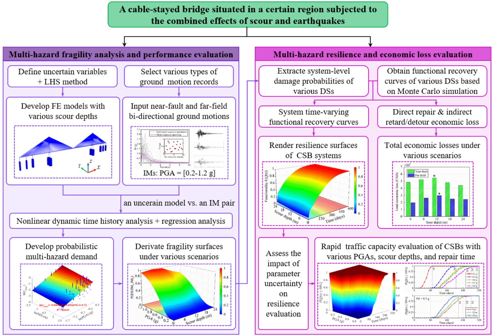  
Fig. 2.  Multihazard fragility, resilience, and economic loss evaluation framework for CSBs.  

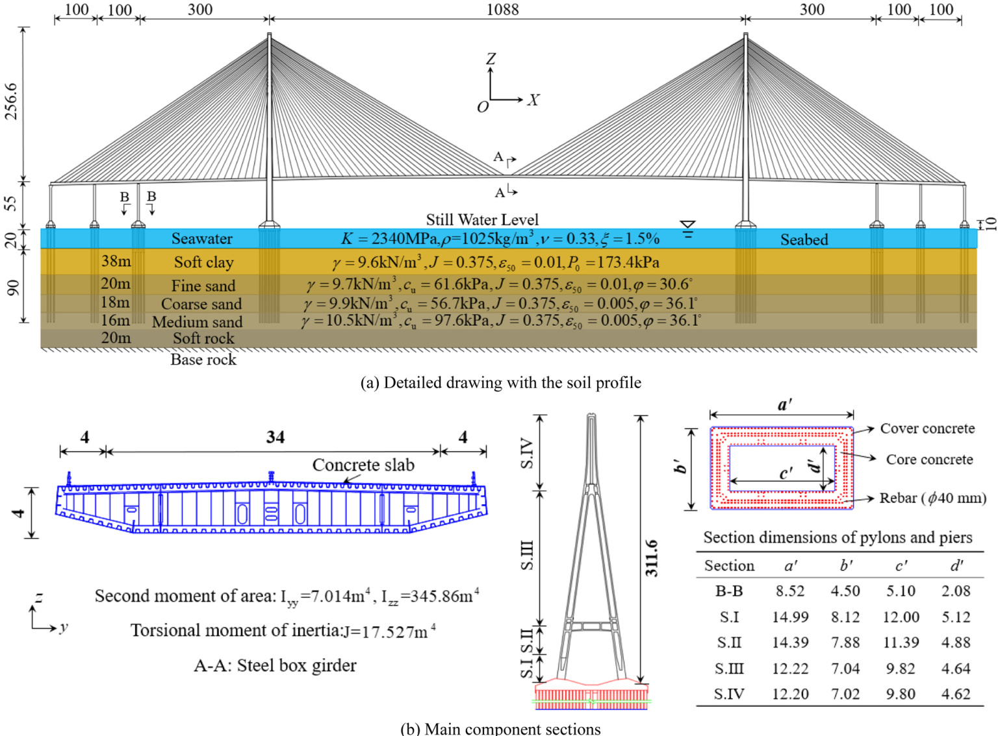  

Fig. 3. a-b. Schematic view of the case CSB (Unit: m).

stands at   $55\;\mathrm{m}$  . The girder, made of Q345 steel, has a uniform cross-  section. The concretes used include C50 for pylons, C40 for piers, and  C35 for piles. Longitudinal bars and stirrups exhibit yield strengths of   $400\;\mathrm{MPa}$   and   $335\;\mathrm{MPa}$  , respectively. The Poisson ’ s ratios of steel and  concrete are set to 0.3 and 0.2, respectively. The mass densities of steel  and concrete are set to  $7850\;\mathrm{kg}/\mathrm{m}^{3}$    and  $2500\;\mathrm{kg}/\mathrm{m}^{3}$  , respectively. The  upper   $20\:\mathrm{m}$   of the pile foundations are submerged, each with di­ mensions of   $2.5\:\mathtt{m}$   in diameter and   $^{110\;\mathrm{m}}$   in length, along with 72  longitudinal bars. Cable cross-sectional areas span   $98.{\bar{52}}\,\mathrm{cm}^{2}$  to   $203.58\;\mathrm{cm}^{2}$  , with a tensile strength of   $1770\:\mathrm{MPa}$  . The CSB employs a  semifloating system incorporating sixteen lead rubber bearings (LRBs)  between the main girder and pylons/piers, with bearings fixed in the  transverse direction.  

# 3.2. Finite element model  

The 3-D nonlinear finite element model (FEM) of the case CSB  established via  OpenSees  and the mechanical properties of various ma­ terials and components are depicted in  Fig. 4 (a). The main girder is  modeled with elastic beam elements, anticipated to remain within the  elastic range during earthquake excitations, and subjected to uniform  dead loads equal to the weight per unit length of the girder. Meanwhile,  piers are modeled using displacement-based nonlinear beam elements  considering the  $P–\Delta$    effect. The pylon is represented using two methods:  the part from the pile cap to the bottom of the tie anchorage zone is  modeled with nonlinear beam elements, and the upper part is simulated  with elastic beam elements. As capacity-protected members, pile foun­ dations are modeled with elastic beam elements. The cross-sectional  area ( A ), cross-section moment of inertia   $(I_{y}$  and  $I_{z})$  , cross-section tor­ sion moment   $(J_{T})$  , elastic modulus   $(E),$  ,  and shear modulus   $(G)$   of the  cross-section material in the elastic beam elements are defined, to  effectively simulate the mechanical characteristics and deformation  compatibility of CSB systems  [1,42,43] . Nonlinear beam elements are  assigned plasticity-distributed fiber sections, with  “ Concrete   $_{01}{}^{,,}$    and  “ Concrete  $_{04},$    materials for cover and core concrete fibers, respectively,  and  “ Steel  $02^{\circ}$    material for longitudinal bars. The pile cap is treated as a  rigid body, connected to piles via rigid links, and modeled with  concentrated mass. We employ 104, 176, 284, and 7448 elements to  model piers, pylons, the main girder, and piles, respectively. The lengths  of each pier, pylon, main girder, and pile element are not uniform and  approximately measure 2, 1.5, 5, and   $6\:\mathrm{m}$  , respectively. Cables are  simulated using  “ In itS train Material ”  assigned to large-displacement  truss elements and modified for the sag effect using the Ernst method;  then, initial strains are assigned. Additionally, elastic-plastic bearing  elements are employed to simulate LRBs.  

To account for the soil-structure interaction (SSI), nonlinear zero-  length p-y, t-z, and Q-z soil spring elements are employed in each pile  node. These elements simulate lateral soil resistance, axial pile friction,  and pile tip support resistance  [44 – 49] . The parameters for the p-y, t-z,  and   ${\bf Q}–{\bf z}$   curves, corresponding to various depths within the clay and  sand layers, are determined based on recommendations derived from  API, Matlock, O ’ Neil, and Reese ’ s studies  [50 – 53] . Key soil parameters  

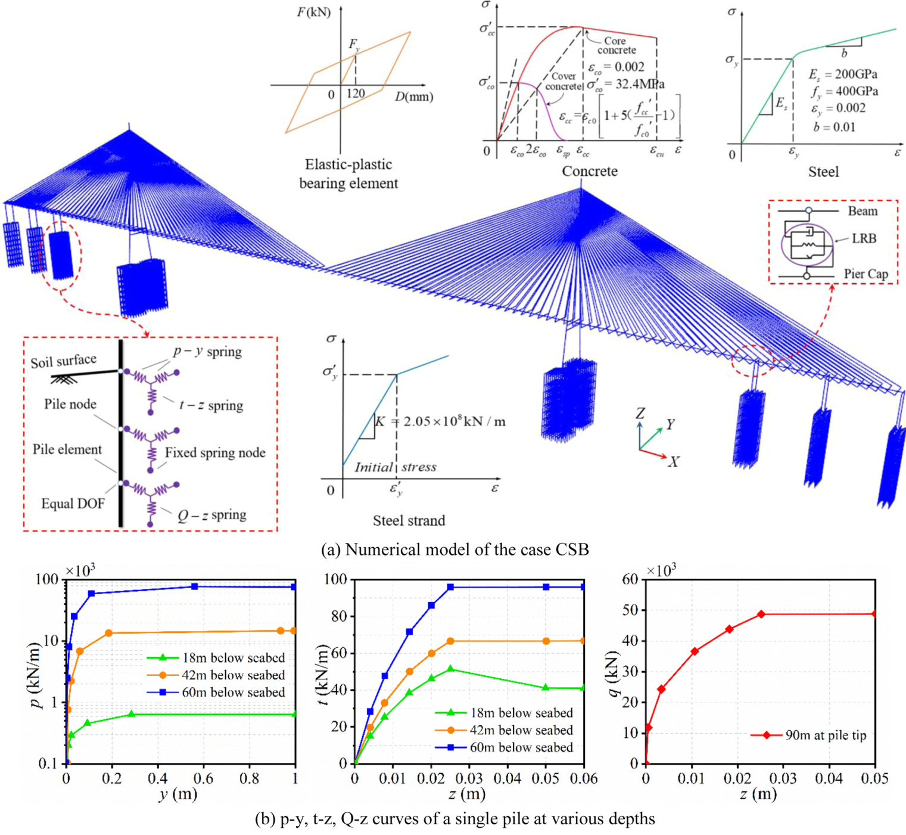  
Fig. 4. a-b.  FE model of the case CSB with the mechanical properties for concrete fiber, steel fiber, cable elements, bearing elements, and p-y, t-z, Q-z curves of a  single pile at various depths.  

for each layer, including soil weight   $(\gamma)$  , undrained shear strength   $(c_{u})$  dimensionless empirical constant  $(J)$  , strain corresponding to one-half of  the maximum stress in undrained compression tests   $(\varepsilon_{50})$  , angle of in­ ternal friction  $(\varphi)$  , and shaft friction of factor   $(\beta)$  , as illustrated in  Fig. 3  (a), are utilized to compute the mechanical properties of the soil springs.  The derived p-y, t-z, and Q-z curves, illustrating the behavior of a single  pile beneath the pylon at various depths, are presented in  Fig. 4 (b).  Classical Morison equations are utilized to calculate the hydrodynamic  added mass load on group piles to model the water-structure interaction  (WSI)  [54] . Rayleigh damping is applied to FEMs using the first 2 orders  of model frequencies and a  $5\;\%$   damping ratio  [42] .  

# 3.3. Simulation method of pile scour  

To account for variations in scour hazard intensities and model  reductions in lateral and axial resistance caused by scour erosion around  pile foundations, the p-y and t-z soil spring elements above different  scour depths are removed. The mechanical parameters of the remaining  soil springs require recalculation. Additionally, the submerged pile  length increases with scour depth, altering the WSI effect on the piles, as  shown in  Fig. 5 .  

# 3.4. Latin hypercube sampling  

The stochastic nature of the occurrence of multiple hazards and  associated structural parameters plays a crucial role in evaluating the  CSB performance. To account for the inherent uncertainties linked to the  CSB, 20 uncertainty parameters related to structural geometries, mate­ rials, and soil properties are chosen for the modeling of uncertain FEMs.  The probability distributions and detailed parameter descriptions are  

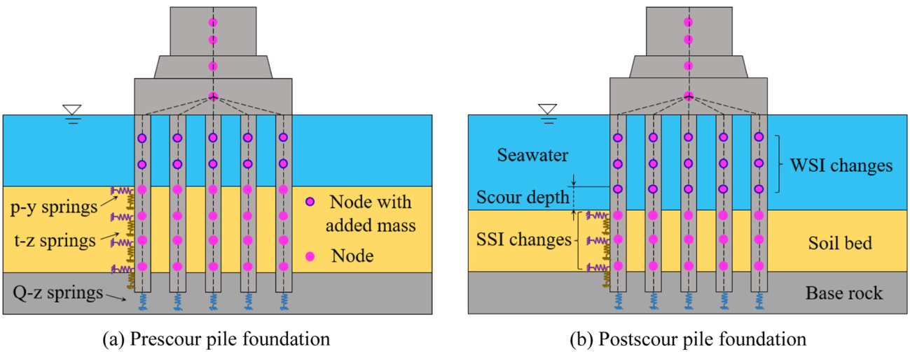  
Fig. 5.  The simulation approach for scour depths and hydrodynamic effects.  

<td><table  border="1"><thead><tr><td><b> Names</b></td><td><b>Characterizing parameters</b></td><td colspan="2"><b>Means</b></td><td><b>COVs /%</b></td><td><b>Distributions</b></td><td><b>Upper levels</b></td><td><b>Lower levels</b></td></tr></thead><tbody><tr><td rowspan="2"> f.ecore (MPa)</td><td rowspan="2">Peak strength for core concrete</td><td>C50</td><td>35.65</td><td rowspan="2">20 </td><td rowspan="2">Lognormal</td><td>71.01</td><td>19.51</td></tr><tr><td>C40</td><td>30.28</td><td>51.57</td><td>18.72</td></tr><tr><td rowspan="2">Ec.core (-)</td><td rowspan="2">Strain at peak strength for core concrete</td><td>C50</td><td>0.0022</td><td></td><td rowspan="2">Lognormal</td><td>0.0037</td><td>0.0011</td></tr><tr><td>C40</td><td>0.0019</td><td></td><td>0.0031</td><td>0.001</td></tr><tr><td rowspan="2"> feucore (MPa)</td><td rowspan="2">Crushing strength for core concrete</td><td>C50</td><td>25.95</td><td></td><td rowspan="2">Lognormal</td><td>51.16</td><td>16.45</td></tr><tr><td>C40</td><td>20.29</td><td></td><td>35.68</td><td>12.68</td></tr><tr><td rowspan="2">Ecu,core (-)</td><td rowspan="2">Strain at crushing strength for core concrete</td><td>C50</td><td>0.0137</td><td></td><td rowspan="2">Lognormal</td><td>0.0231</td><td>0.0088</td></tr><tr><td>C40</td><td>0.0044</td><td></td><td>0.0070</td><td>0.0027</td></tr><tr><td rowspan="2"> f.ecover (MPa)</td><td rowspan="2">Peak strength for cover concrete</td><td>C50</td><td>32.4</td><td>20</td><td rowspan="2">Lognormal</td><td>50.84</td><td>19.66</td></tr><tr><td>C40</td><td>26.8</td><td></td><td>53.29</td><td>16.82</td></tr><tr><td rowspan="2">Ec,cover (-)</td><td rowspan="2">Strain at peak strength for cover concrete</td><td>C50</td><td>0.0020</td><td></td><td rowspan="2">Lognormal</td><td>0.0034</td><td>0.0013</td></tr><tr><td>C40</td><td>0.0018</td><td></td><td>0.0029</td><td>0.0011</td></tr><tr><td rowspan="2"> feu.cover (MPa)</td><td rowspan="2">Crushing strength for cover concrete</td><td>C50</td><td>22.73</td><td></td><td rowspan="2">Lognormal</td><td>41.66</td><td>12.13</td></tr><tr><td>C40</td><td>17.96</td><td></td><td>31.74</td><td>11.62</td></tr><tr><td rowspan="2">Ecu,cover (-)</td><td rowspan="2">Strain at crushing strength for cover concrete</td><td>C50</td><td>0.0040</td><td></td><td rowspan="2">Lognormal</td><td>0.0068</td><td>0.0024</td></tr><tr><td>C40</td><td>0.0037</td><td></td><td>0.0059</td><td>0.0025</td></tr><tr><td>do (mm)</td><td>Diameter of steel bars</td><td colspan="2">40 </td><td>2 </td><td>Lognormal</td><td>41.98</td><td>38.04,</td></tr><tr><td>E (MPa)</td><td>Initial stiffness of steel bars</td><td colspan="2">200,000</td><td>5</td><td>Lognormal</td><td>228300</td><td>182070</td></tr><tr><td>fy (MPa)</td><td>Yield strength of steel bars</td><td colspan="2">400</td><td>10</td><td>Lognormal</td><td>498.9</td><td>299.2</td></tr><tr><td>bs (-),</td><td>Stiffness ratio after yielding of steel bars</td><td colspan="2">0.01</td><td>20</td><td>Lognormal</td><td>0.019</td><td>0.006</td></tr><tr><td>Fy (kN)</td><td>Lateral yield strength of bearings</td><td colspan="2">36.5</td><td>10</td><td>Lognormal</td><td>46.5</td><td>29.6</td></tr><tr><td>k (kN/m)</td><td>Initial stiffness of bearings</td><td colspan="2">2990</td><td>10</td><td>Lognormal</td><td>3746</td><td>2286</td></tr><tr><td>fye (MPa)</td><td>Tensile strength of cables</td><td colspan="2">1770</td><td>10</td><td>Lognormal</td><td>2185</td><td>1243</td></tr><tr><td>Mack (-)</td><td>Girder mass per unit length</td><td colspan="2">1.0Mdeck</td><td>5.8</td><td> Normal</td><td>0.8Mack</td><td>1.17Maeck</td></tr><tr><td>s (-)</td><td>Damping ratio</td><td colspan="2">0.05</td><td>5</td><td> Normal </td><td>0.056</td><td>0.043</td></tr><tr><td> (kN/m²)</td><td>Typical submerged soil unit weight</td><td colspan="2">9.7.</td><td>7</td><td>Normal</td><td>11.38</td><td>7.91</td></tr><tr><td>(0)</td><td>Typical submerged sand friction angle</td><td colspan="2">30.6</td><td>5</td><td> Normal</td><td>34.96</td><td>26.85</td></tr><tr><td>cu (kPa)</td><td>Typical submerged sand undrained shear strength</td><td colspan="2">61.6</td><td>35</td><td>Lognormal</td><td>149.97</td><td>26.34</td></tr></tbody></table></td>  

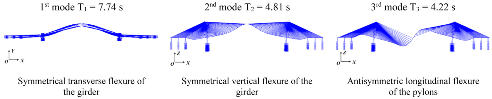  
Fig. 6.  The first 3 mode shapes of the case CSB in the unscoured condition.  

summarized in  Table 2 .  [18,43,55] . The LHS  [56]  is a multidimensional  stratified random sampling technique developed based on the Monte  Carlo (MC) method. In contrast to MC, LHS maximizes the utilization of  the sample space, ensuring a broader interval coverage with a reduced  sample size. Recognizing that incorporating more uncertainty models  enhances precision in analysis results, an uncertain parameter size of  120 is assigned for the uncertain FEMs which match accordingly 20  (ground motions)   $\times\;6$   (ground motion intensities)  $=120$   seismic load  cases for each ground motion type. Upper and lower bounds are  implemented to prevent negative values existing in random samples.  

<td><table  border="1"><thead><tr><td><b>Modes</b></td><td colspan="5"><b>Differences (%)</b></td></tr><tr><td></td><td><b>0m</b></td><td><b>6 m</b></td><td><b>12 m</b></td><td><b>18 m</b></td><td><b>24 m</b></td></tr></thead><tbody><tr><td>1</td><td>-</td><td>0.001</td><td>0.002</td><td>0.002</td><td>0.003</td></tr><tr><td>2</td><td>-</td><td>0.025</td><td>0.058</td><td>0.084</td><td>0.096</td></tr><tr><td>3</td><td>-</td><td>0.033</td><td>0.077</td><td>0.111</td><td>0.127</td></tr></tbody></table></td>  

# 4. Multihazard fragility analysis  

# 4.1. Dynamic characteristics of the case CSB considering scour effects  

The dynamic characteristics of the case CSB were examined before  delving into the analysis of multihazard fragility.  Fig. 6  illustrates the  first 3 mode shapes and vibration periods of the unscoured case CSB.  Differences in vibration periods for various scour scenarios, i.e., 0, 6, 12,  18, and   $24\;\mathrm{m}$   scour depth, are presented in  Table 3 . These differences  were computed as the rate of change in natural vibration periods  attributed to scour effects relative to the natural vibration periods of the  CSB without scour effects. It is essential to emphasize that the sequence  of natural vibration modes remained unchanged across different scour  depths. Additionally, as indicated in  Table 3 , various scour hazard in­ tensities (i.e., scour depths) minimally impact the frequency/mode of  the CSB. Drawing from previous engineering experience and research,  scour effects have a negligible influence on the frequency/mode of such  a pile-group supported super-long span CSB. However, these effects  significantly impact the strong nonlinearity and anti-collapse perfor­ mance (i.e., failure probability) of the CSB, particularly in the context of  a strong earthquake. Consequently, the influence of various scour depths  (i.e., structural stiffness degradation) on the posthazard performance of  the CSB under strong earthquakes cannot be overlooked.  

# 4.2. Incremental dynamic analysis  

Two sets of near-fault and far-field ground motions are chosen from  the PEER-NGA database ( https://peer.berkeley.edu/nga/ ). Detailed in­ formation regarding these 40 ground motions is available in  [57] . The  original PGAs of near-fault and far-field ground motions span   $0.11~g$   to   $0.85\;g$   and  $0.02\;g$   to  $0.36\;g$  , with corresponding peak ground velocities  reaching 133.4 and   $26.3\;\mathrm{cm}/\mathrm{s}$  , respectively. The acceleration response  spectra and mean response spectra are shown in  Fig. 7 a-b. Compared  with far-field ground motions, near-fault ground motions exhibit greater  spectral accelerations with higher intrinsic seismic energy. Additionally,  the input ground motion intensity is quantified by PGA, a widely utilized  ground motion IM in seismic fragility analyses for both girder bridges  and CSBs  [58 – 60] .  

The scour depth  $H_{m}$  for foundations is determined using the local pile  scour depth formula  [61] :  

$$
H_{m}=8.48k_{1}k_{2}B_{w}^{0.326}u_{f}^{0.628}h_{m}^{0.193}d_{50}^{0.167}
$$

where  $k_{1}$  and  $k_{2}$  are the transverse and longitudinal layout coefficients of      group piles, respectively, both equal to   $1;B_{w}$  indicates the water barrier    width of foundations and is equal to   $48.1\;\mathrm{m};\,u_{f}$  is the maximum flow  velocity and is equal to   $5\,\mathrm{m}/\mathrm{s};$  ;  $h_{m}$  signifies the maximum water depth    and is equal to  $20\;\mathrm{m};$   and  $d_{50}$  denotes the average median particle size of    sediments and is equal to   $0.03\:\mathrm{mm}$  . In addition, due to reciprocating  tidal currents scouring the foundations, the computation involves  multiplying by an empirical reduction factor (0.8); thus,  $H_{m}$  is calculated    as   $20.7\;\mathrm{m}$  . Considering the maximum obtained scour depth at this site,  five scour intensities corresponding to scour depths of 0, 6, 12, 18, and   $24\;\mathrm{m}$   are conservatively applied to evaluate the impact of scour hazards  on the performance of the CSB.  

To investigate the multihazard performance of CSBs under various  IM pairs, specific incident angles are chosen, aligning with two main  horizontal earthquake components corresponding to the transverse and  longitudinal directions of CSBs. Due to computational constraints, ef­ fects in all potential directions are not considered, given the substantial  computational load. 40 ground motions are scaled from   $0.2\,g$   to   $1.2\,g.$  with intervals of   $0.2\,g$  , and are uniformly applied for excitation simul­ taneously from the transverse and longitudinal directions of CSBs. This  approach aims to provide reliable response data for PSDMs, without  detailed consideration of the coupling effect of bidirectional ground  motion in this study. This results in a match between the adopted 5 scour  depths and 240 sets of scaled bidirectional ground motions (40 ground  motions  $\times\,\,6$   ground motion intensities), forming hazard sample pairs.  These pairs are randomly associated with the uncertain FEMs for IDA.  

# 4.3. Probabilistic multihazard demand model  

Probabilistic demand models are established through nonlinear dy­ namic analyses and log-linear statistical regression with PGA and scour  depth (SD) as intensity measures for earthquakes and scour   $(I M_{e q}$  and   $I M_{s c o u r})$  .  Fig. 8  shows the fitted probabilistic multihazard demand model  of two CSB components at a   $24\;\mathrm{m}$   scour depth in the longitudinal di­ rection.  Table 4  lists the coefficient of determination   $(R^{2})$  , indicating  that nonlinear dynamic responses conform effectively to the 1st-order  probabilistic demand model. As shown in  Eqs. (1) – (2) , the probabi­ listic multihazard demand models can be expressed as:  

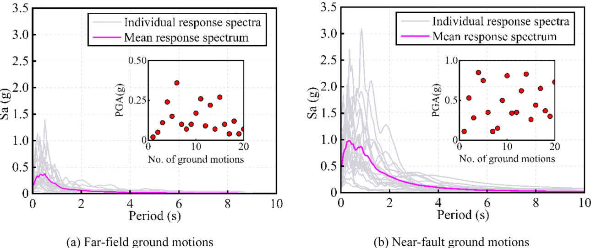  

Fig. 7. a-b. Response spectra with a damping ratio of 5 % and PGA distributions.

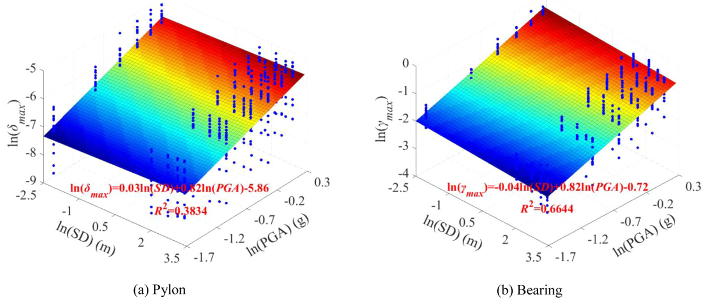  
Fig. 8.  Probabilistic multihazard demand models of various CSB components.  

<td><table  border="1"><thead><tr><td><b>Types</b></td><td><b>Components</b></td><td><b>Directions</b></td><td><b>P1</b></td><td><b>P2</b></td><td><b>po</b></td><td><b>OD[IMeg,IMcor</b></td><td><b>R2</b></td></tr></thead><tbody><tr><td rowspan="8"> Near-fault</td><td rowspan="2">Pylon</td><td>L</td><td>0.03</td><td>0.82</td><td>-5.86</td><td>0.638</td><td>0.383</td></tr><tr><td>T</td><td>0.007</td><td>0.92</td><td>-6.06</td><td>0.828</td><td>0.313</td></tr><tr><td rowspan="2">Pier</td><td>1</td><td>-0.007</td><td>0.60</td><td>-2.74</td><td>0.350</td><td>0.519</td></tr><tr><td>T</td><td>0.0001</td><td>0.61</td><td>-1.02</td><td>0.349</td><td>0.526</td></tr><tr><td rowspan="2">Bearing</td><td></td><td>-0.04</td><td>0.82</td><td>-0.72</td><td>0.358</td><td>0.664</td></tr><tr><td>T</td><td>一</td><td>-</td><td>一</td><td>一</td></tr><tr><td rowspan="2">Cable</td><td>L</td><td>0.006</td><td>0.21</td><td>-1.28</td><td>0.163</td><td>0.383</td></tr><tr><td>T</td><td>0.005</td><td>0.23</td><td>-1.22</td><td>0.164</td><td>0.380</td></tr><tr><td rowspan="8">Far-field</td><td rowspan="2">Pylon</td><td>L</td><td>0.03</td><td>0.76</td><td>-6.27</td><td>0.619</td><td>0.362</td></tr><tr><td>T</td><td>0.009</td><td>0.98</td><td>-6.46</td><td>0.877</td><td>0.313</td></tr><tr><td rowspan="2">Pier</td><td>L</td><td>-0.005</td><td>0.50</td><td>-3.08</td><td>0.320</td><td>0.472</td></tr><tr><td>T</td><td>-0.001</td><td>0.51</td><td>-1.38</td><td>0.304</td><td>0.505</td></tr><tr><td rowspan="2">Bearing</td><td>L</td><td>-0.04</td><td>0.76</td><td>-1.00</td><td>0.317</td><td>0.688</td></tr><tr><td>T</td><td>一</td><td>一</td><td>-</td><td>一</td><td>一</td></tr><tr><td rowspan="2">Cable</td><td>1</td><td>0.006</td><td>0.17</td><td>-1.38</td><td>0.152</td><td>0.304</td></tr><tr><td>T</td><td>0.005</td><td>0.20</td><td>-1.31</td><td>0.153</td></tr></tbody></table></td>

Note:  “ T ”  and  “ L ”  indicate transverse and longitudinal directions of CSBs, respectively.  

<td><table  border="1"><thead><tr><td><b>Components</b></td><td><b>DIs</b></td><td><b> Slight damage</b></td><td><b> Moderate damage</b></td><td><b>Extensive damage</b></td><td><b>Complete damage</b></td></tr></thead><tbody><tr><td>Pylon</td><td>ot</td><td>> 0.007 St</td><td>t >0.015</td><td>t > 0.025</td><td>Ot</td></tr><tr><td>Pier</td><td>Hs</td><td>μg >1</td><td>μs>2</td><td>μ>4</td><td>> 0.05 Hs ±>7</td></tr><tr><td>Bearing</td><td>Yb</td><td>> 100 %</td><td>Yb > 150 %</td><td>Yb > 200 %</td><td>> 250 % Yb</td></tr><tr><td>Cable</td><td>e/ey</td><td>e/ey >0.45</td><td>e/ey >0.6</td><td>e/ey > 0.75</td><td>>0.9 e/ey</td></tr></tbody></table></td>  

#  $\ln\!\left(\delta_{t,m a x}\right)=0.03\mathrm{ln}(S D)+0.82\mathrm{ln}(P G A)-5.86$  for pylon  

$\ln(\mu_{\phi,m a x})=-0.007\ln(S D)+0.60\ln(P G A)-2.74$  ( = − ( ) + ( ) − for pier

  $\ln(\gamma_{m a x})=-0.04\ln(S D)+0.82\ln(P G A)-0.72$  ( ) = − ( ) + ( ) − for bearing

  $\ln\!\left(\varepsilon_{m a x}/\varepsilon_{y}\right)=0.006\ln(S D)+0.21\ln(P G A)-1.28$  for cable  

# 4.4. Description of component damage limit states  

Various components could reach distinct damage levels under mul­ tiple hazards. Structural response analyses record the pylon top drift rate   $\left(\delta_{t}\right)$  , pier section curvature ductility  $(\mu_{\phi})$  , bearing shear strain   $(\gamma_{b})$  , and  cable force   $(f)$  . The cable strain ratio   $(\varepsilon/\varepsilon_{y})$   is utilized as the damage  indicator, where  $\varepsilon=f/(A_{c}{\cdot}E_{c});A_{c}$    and  $E_{c}$    denote the cross-sectional area  and elastic modulus of cables, respectively; and   $\varepsilon_{y}$  indicates the yield  strain  [43] . The maximum response of each CSB component type serves  as the damage index (DI). The capacity parameters, specifically  $\mu_{C}$  and   $\sigma_{C}$    in  Eq. (4) , can be determined through expert assessments, experi­ mental data, or numerical simulations. In the present investigation,  $\mu_{C}$  is    derived from previous studies, as detailed in  Table 5 . The  $\sigma_{C}$    for each DI  is assumed to be 0.35, except for the cable strain ratio, which is specified  as 0.1  [18,43] . Moreover, only the elastic behavior of pile foundations  and the longitudinal performance of bearings are considered, excluding  fragility.  

# 4.5. Multihazard fragility analysis  

Upon establishing probabilistic demand models and DSs for CSB  components, multihazard fragility surfaces can be obtained using the  

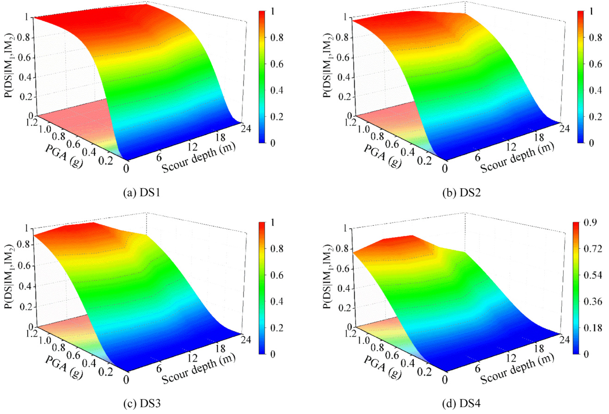  
Fig. 9.  Fragility surfaces of the bearing component under multiple hazards.  

method in  Section 2.4 . The fragility surfaces for various components  exhibit similar trends; thus,  Fig. 9  only displays the longitudinal bearing  fragility surfaces for various PGAs and scour depths under near-fault  ground motions for different DSs. Increasing the PGA raises the DS ex­ ceedance probability at a specific scour depth. Moreover, at a given  PGA, bearing damage probabilities initially rise with scour depth, pla­ teauing at approximately   $6\:\mathrm{m}$   and   $^{12\:\mathrm{m}}$  , and then nonlinearly decline  beyond  $^{12\:\mathrm{m}}$   due to varied levels of pile displacements, which result in  different levels of bearing strain. This should not be considered a bearing  improvement, rather, damage shifts to piers due to scour-induced  structural flexibility. In multihazard fragility cases, bearings and py­ lons display the highest damage probabilities, and piers and cables  present the lowest, consistent with prioritizing pier prevention. Miti­ gation is crucial for safeguarding vulnerable bearings and pylons.  

To further explore the scour effects on the fragility of CSB systems in  cases with multihazard scour and earthquakes,  Fig. 10  displays multi­ hazard fragility surfaces and the corresponding contours. Notably, the  fragility surfaces for various DSs exhibit similar traits, with only fragility  surfaces for DS3 showcased here. The disparity in longitudinal and  transverse responses stems from the differences in the bidirectional  dynamic traits of CSBs, with the longitudinal direction proving more  susceptible to load effects, especially in cases with near-fault ground  motions. Transverse fragility changes minimally with scour depth.  Concerning longitudinal fragility, pile scour generally degrades CSB  performance, yet the most critical point is not at the maximum scour  depth. Examining the contours, it is evident that longitudinal fragility  initially rises with scour depth and then significantly drops beyond   ${\displaystyle12~\mathrm{m}}$  . As shown in  Fig. 10 (a), as an example, CSBs with a   $^{12\;\mathrm{m}}$   scour  depth display the highest exceedance probability   $(84.83\,\%)$   for IM   $=0.8\,\mathrm{g},$  , and unscoured CSBs and those with a  $24\;\mathrm{m}$   scour depth exhibit  the probabilities of   $78.33\;\%$   and   $64.58\;\%$  , indicating drops of   $7.66\;\%$  and   $23.87\ \%$  , respectively. The contours further demonstrate that the  fragility of CSBs for each DS is more sensitive to PGA than the scour  depth. Longitudinal fragilities respond more to scour depth than  transverse fragilities, underscoring the need to consider scour effects  when evaluating longitudinal CSB performance. Moreover, a compari­ son between component- and system-level fragility surfaces in  Figs. 9 (c)  and  10 (a) reveals that depending solely on bearing longitudinal fragility  could lead to underestimated structural damage levels, e.g., a   $16\;\%$  decrease at  $\mathsf{P G A}=1.2\,\mathrm{g}$   and scour depth  $=24{\mathrm{~m}}$  .  

# 5. Multihazard resilience and economic loss evaluation  

# 5.1. Multihazard functional recovery process and resilience evaluation  

To simultaneously address responses in both seismic directions, the  maximum combined pylon top drift rate, pier section curvature  ductility, and bearing shear strain are employed as structural response  parameters, uniformly expressed as  $r_{\mathrm{max}}\,=M a x[\sqrt{r_{x}^{2}(t)+r_{y}^{2}(t)}]$  √ ̅̅̅̅̅̅̅̅̅̅̅̅̅̅̅̅̅̅̅̅̅̅̅̅̅ , where   $r_{x}(t)$   and   $r_{y}(t)$   denote the transverse and longitudinal response time  histories of the CSB components, respectively  [62] . Despite the prox­ imity of longitudinal and bidirectional fragility for CSBs, the precise  bidirectional fragilities of CSB systems at various DSs with moderate and  high intensities, i.e.,  $\mathsf{P G A}=0.4\;\mathsf{g}$   and   $0.8\;\mathrm{g}.$  , are chosen as examples for  subsequent recovery process evaluation and resilience evaluation.  Damage probabilities are computed using  Eqs. (5) – (6) , and time-varying  functionality curves are derived from  Eqs. (7) – (8) . The distributions of  uncertain parameters for functional recovery processes are simplified to  consider and outlined in  Table 6  referring to  [37] . Functionality levels  can be assessed through Monte Carlo simulation.  Fig. 11  depicts the  mean time-varying functional recovery surfaces across various scenarios  with low functionality values under near-fault ground motions. Func­ tionality values initially decrease with increasing scour depth, but start  to increase when the scour depth exceeds  ${\displaystyle12~\mathrm{m}}$  , which contrasts with the  variation trends of longitudinal fragility surfaces in  Fig. 10 .  

Resilience values are computed using  Eq. (9)  with mean time-varying  functionality values over a 600-day interval.  Table 7  compares  

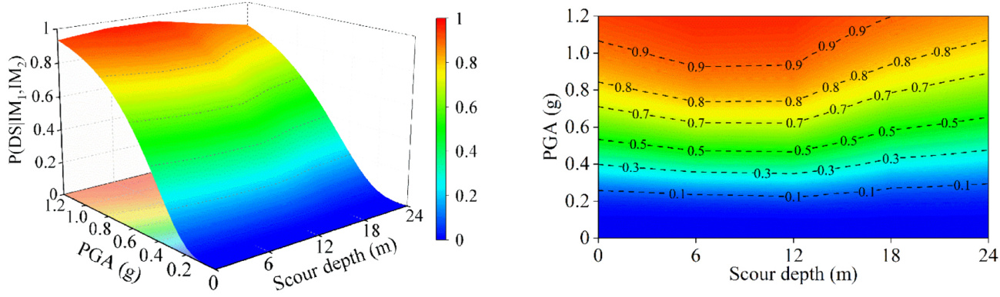  

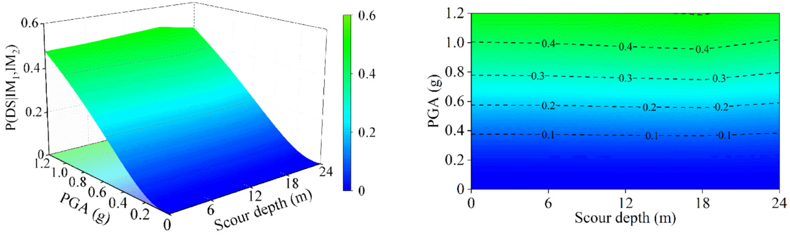  

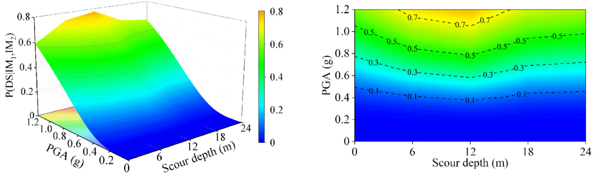  

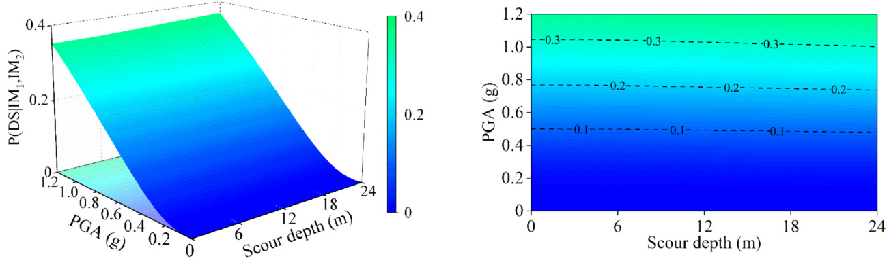  

Fig. 10. Fragility surfaces of CSBs for DS3 in various scenarios.  

transverse, longitudinal, and bidirectional resilience values for each case  scenario. Lower resilience values under near-fault ground motions due  to high damage probabilities lead to diminished residual functionality  and extended recovery time. Moreover, the longitudinal and  bidirectional resilience values for CSBs decline as the scour depth in­ creases but begin to rise when the scour depth surpasses   $^{12\:\mathrm{m}}$  . Trans­ verse resilience values vary minimally with scour depth. These trends  correspond to functionality value patterns. Despite a minor difference  

<td><table  border="1"><thead><tr><td rowspan="2"><b> Parameters</b></td><td rowspan="2"><b>Distributions (triangular)</b></td><td colspan="4"><b> Damage states</b></td></tr><tr><td><b> Slight</b></td><td><b>Moderate</b></td><td><b>Extensive</b></td><td><b>Complete</b></td></tr></thead><tbody><tr><td>Mean</td><td>min</td><td>0.2 </td><td>1</td><td>30</td><td>120</td></tr><tr><td>recovery</td><td>mod</td><td>0.6</td><td>2.5</td><td>75</td><td>230</td></tr><tr><td>time (days)</td><td>max</td><td>1</td><td>5</td><td>120</td><td>360</td></tr><tr><td>Mean idle</td><td>min</td><td>0.1 </td><td>0.5 </td><td>3</td><td>6</td></tr><tr><td>time (days)</td><td>mod</td><td>0.3</td><td>1.3</td><td>7.5</td><td>15</td></tr><tr><td></td><td>max</td><td>0.5</td><td>2.5 </td><td>12</td><td>24</td></tr><tr><td>COVs</td><td>/</td><td>1</td><td>1</td><td>0.56</td><td>0.48</td></tr></tbody></table></td>

Note:   $\begin{array}{r}{\mathrm{COV}\mathscr{s}=\mathscr{e}}\end{array}$  coefficients of variation.  

between longitudinal and bidirectional resilience values, with a  maximum variance of   $4.56\;\%$  , bidirectional resilience values are rec­ ommended in engineering practice. Moreover, resilience value fluctua­ tions for CSBs subjected to near-fault ground motions are more  influenced by scour depths than by other factors, with the maximum  change percentage of resilience values and corresponding fragilities  reaching  $34\;\%$   and  $31.4\;\%$  , respectively, for DS3 in CSB systems across  various scour depths and near-fault ground motions at  $\mathbf{IM}=0.8\;\mathrm{g}$  . As the  scour depth increases, the natural vibration periods of higher modes,  encompassing the vibration of the pile foundation, increase with the  rising scour depths  [16] . Furthermore, near-fault ground motions typi­ cally contain more high-frequency components. Due to the low natural  frequency of large-span CSBs, resonance with the high-frequency com­ ponents may cause increased structural impact and damage. Addition­ ally, near-fault ground motion features tend to exhibit greater  complexity, such as pulse-type ground motion, velocity pulse, etc. These  characteristics may induce amplified structural vibration and nonlinear  behavior, thus resulting in a larger fluctuation of resilience values of  large-span CSBs at different scour depths. Thus, it is crucial to account  for scour effects when conducting resilience evaluations and  resilience-based structural design in near-fault zones.  

# 5.2. Economic loss evaluation  

The direct losses for CSBs with various scour depths and in different  scenarios are assessed using  Eq. (10) , Monte Carlo simulation, and the  uncertain parameters in  Table 8 . With  $\mathbf{IM}=0.8\;\mathrm{g}$   as an example,  Fig. 13  (a) illustrates the mean direct losses for CSBs in various scenarios, ac­ counting for bidirectional fragilities and functional recovery. Near-fault  ground motions yield 1.5 – 3 times higher direct losses than far-field  motions. These losses generally increase with scour depth but  diminish with depths surpassing   ${}^{18}\,\mathrm{m}$   for near-fault motions, which  almost aligns with the variation trend of the resilience values. Mean  daily indirect losses are computed using mean time-varying function­ ality values and  Eqs. (10)-(16)  with the parameters from  Table 8 . Total  indirect losses are summed over the recovery time.  Figs. 12 and 13 (b)  compare the mean daily indirect losses and total losses of CSBs at various  scour depths. The total losses under near-fault ground motions are  approximately 1.8 times higher than those under far-field ground mo­ tions. Moreover, the total losses initially increase with scour depth and  then notably decline when the scour depth exceeds  $^{12\:\mathrm{m}}$  . These results  underscore that both the ground motion type and scour depth jointly  impact the economic losses of CSBs.  

The impact of uncertain parameters on resilience evaluation is  examined. The mean functionality of CSBs at a  $24\;\mathrm{m}$   scour depth under  near-fault ground motions at   $\mathbf{IM}=0.8\;\mathrm{g}$   is shown in  Fig. 14  as [E( Q ( t ))],  with  $\upsigma[Q(t)]$   as the standard deviation. The variation characteristics for  both ground motion types are similar. In the early phases (before 300  days), the functional dispersions increase over time to  $18.9\;\%$   and  $9.4~\%$  respectively, but gradually recede as functionality fully recovers.  Fig. 15  presents the probability density functions of functionality at four time  points. Dispersion is high in cases with near-fault motions; thus, ac­ counting for parameter uncertainties is essential in assessing the time-  varying functionality, resilience, and economic losses of CSBs in near-  fault zones.  

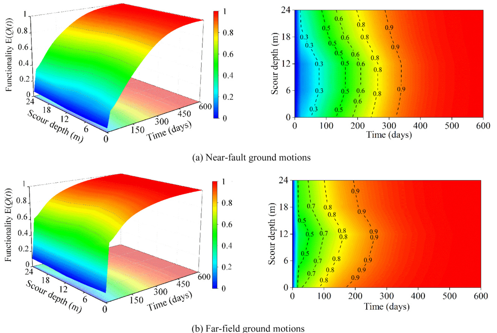  

Fig. 11. Functional recovery surfaces of CSB systems with various scour depths at IM = 0.8 g.  

<td><table  border="1"><thead><tr><td><b>Types</b></td><td><b>IMs</b></td><td><b>Scour depths</b></td><td><b>Transverse</b></td><td><b>Longitudinal</b></td><td><b>Bi-directional</b></td><td><b>Differences (%)</b></td></tr></thead><tbody><tr><td> Near-fault</td><td>0.4 g</td><td>0 m</td><td>0.9381</td><td>0.8605</td><td>0.8510</td><td>1.12</td></tr><tr><td></td><td></td><td>6 m</td><td>0.9395</td><td>0.8223</td><td>0.8140</td><td>1.02</td></tr><tr><td></td><td></td><td>12 m</td><td>0.9390</td><td>0.8115</td><td>0.8032</td><td>1.03</td></tr><tr><td></td><td></td><td>18 m</td><td>0.9397</td><td>0.8815</td><td>0.8711</td><td>1.19</td></tr><tr><td></td><td></td><td>24 m</td><td>0.9432</td><td>0.9023</td><td>0.8891</td><td>1.48</td></tr><tr><td></td><td>0.8 g</td><td>0m</td><td>0.8577</td><td>0.5590</td><td>0.5428</td><td>2.98</td></tr><tr><td></td><td></td><td>6 m</td><td>0.8585</td><td>0.4956</td><td>0.4835</td><td>2.50</td></tr><tr><td></td><td></td><td>12 m</td><td>0.8560</td><td>0.4960</td><td>0.4833</td><td>2.63</td></tr><tr><td></td><td></td><td>18 m</td><td>0.8547</td><td>0.6100</td><td>0.5894</td><td>3.50</td></tr><tr><td></td><td></td><td>24 m</td><td>0.8658</td><td>0.6673</td><td>0.6382</td><td>4.56</td></tr><tr><td> Far-field</td><td>0.4 g</td><td>0m</td><td>0.9428</td><td>0.9604</td><td>0.9551</td><td>0.55</td></tr><tr><td></td><td></td><td>6 m</td><td>0.9437</td><td>0.9442</td><td>0.9403</td><td>0.41</td></tr><tr><td></td><td></td><td>12 m</td><td>0.9436</td><td>0.9303</td><td>0.9267</td><td>0.39</td></tr><tr><td></td><td></td><td>18 m</td><td>0.9439</td><td>0.9505</td><td>0.9456</td><td>0.52</td></tr><tr><td></td><td></td><td>24 m</td><td>0.9438</td><td>0.9541</td><td>0.9487</td><td>0.57</td></tr><tr><td></td><td>0.8 g</td><td>0m</td><td>0.8814</td><td>0.8370</td><td>0.8235</td><td>1.64</td></tr><tr><td></td><td></td><td>6 m</td><td>0.8834</td><td>0.7576</td><td>0.7466</td><td>1.47</td></tr><tr><td></td><td></td><td>12 m</td><td>0.8832</td><td>0.7214</td><td>0.7105</td><td>1.53</td></tr><tr><td></td><td></td><td>18 m</td><td>0.8834</td><td>0.7971</td><td>0.7839</td><td>1.68</td></tr><tr><td></td><td></td><td>24 m</td><td>0.8828</td><td>0.8141</td><td>0.7998</td><td>1.79</td></tr></tbody></table></td>

Note: Blackbody represents the minimum resilience value for each group.  

<td><table  border="1"><thead><tr><td><b>Random parameters</b></td><td><b>Notations</b></td><td><b>Means</b></td><td><b>COVs</b></td><td><b>Distributions</b></td></tr></thead><tbody><tr><td>Mean daily traffic</td><td>MDT</td><td>39,500a</td><td>DNA</td><td>DNA</td></tr><tr><td>Daily truck traffic ratio</td><td>T</td><td>13 %a</td><td>DNA</td><td>DNA</td></tr><tr><td>Link length containing the bridge (km)</td><td>Lt</td><td>6a</td><td>DNA</td><td>DNA</td></tr><tr><td>Detour distance (km)</td><td>La</td><td>2a</td><td>DNA</td><td>DNA</td></tr><tr><td>Vehicle occupancy for cars</td><td>0c</td><td>1.5a</td><td>DNA</td><td>DNA</td></tr><tr><td>Vehicle occupancy for trucks</td><td>ot</td><td>1.05a</td><td>DNA</td><td>DNA</td></tr><tr><td>Cost growth rate of underwater repairs</td><td>re</td><td>2.5b</td><td>DNA</td><td>DNA</td></tr><tr><td>Recovery time growth rate of underwater repairs</td><td>rt</td><td>1.5b</td><td>DNA</td><td>DNA</td></tr><tr><td>Rebuilding costs for pier/pylon per m² (USD/m²)</td><td>Ce/cp</td><td>100,000b</td><td>0.2 </td><td>LNb</td></tr><tr><td>Rebuilding costs for a single bearing (USD)</td><td>Cb</td><td>10,000b</td><td>0.2 </td><td>LNb</td></tr><tr><td>Rebuilding costs for a single cable (USD)</td><td>Cc</td><td>128,400b</td><td>0.2 </td><td>LNb</td></tr><tr><td>Driving expenses for cars (USD/  km)</td><td>Cr,car</td><td>0.4c</td><td>0.2 </td><td>LNc</td></tr><tr><td>Driving expenses for trucks (USD/km)</td><td>Cr,ruck</td><td>0.57°</td><td>0.2 </td><td>LNc</td></tr><tr><td>Hourly wage for car drivers (USD/h)</td><td>Cs,car</td><td>11.91°</td><td>0.3</td><td>LNc</td></tr><tr><td>Hourly wage for truck drivers (USD/h)</td><td>CSs,ruck</td><td>29.87c</td><td>0.3</td><td>LNc</td></tr><tr><td>Mean speed on the intact link (km/h)</td><td>Sin</td><td>80°</td><td>0.2 </td><td>LNc</td></tr><tr><td>Mean detour speed (km/h)</td><td>Sade</td><td>50°</td><td>0.2 </td><td>LNc</td></tr><tr><td>Mean speed on the damaged link (km/h)</td><td>Sda</td><td>65b</td><td>0.2 </td><td>LNb</td></tr></tbody></table></td>

Note:  $\mathbf{LN}=\mathbf{Log}$  -normal distribution; and DNA  $=$   does not apply;  a  Data from  [36]  b  Assumed  c  Data from  [37]  

# 5.3. Rapid bridge traffic capacity evaluation  

This study demonstrates the impacts of IMs, seismic type, and scour  depth on multihazard fragility and resilience assessment. An effective  method for promptly estimating the traffic capacity of CSBs is crucial for  decision-makers to determine bridge access modes for various PGAs,  scour depths, and repair times (RTs). To address this need, the concept of  the critical traffic capacity surface (CTCS) is proposed through the total  probability theorem as follows:  

$$
P\Bigg[Q(t)\geq Q_{J t s}\Bigg|I M,H_{s},R T\Bigg]=\sum_{k=1}^{4}P\big[Q_{k}(t)\geq Q_{J t s}\big|S_{C_{k}}\big]\cdot P_{s y s,k}\big|S_{D}\geq S_{C_{k}}\Bigg|I M,H_{s}\Bigg]
$$

where   $Q_{f l s}$  denotes the functionality limit state from  Table 1  and   $P_{s y s,k}^{'}[S_{D}\geq S_{C_{k}}|I M,H_{s}]$   is the system damage probability of each DS with  various scour depths and IMs. With the limit state of at least a half-lane  opening (i.e.,   $Q_{f l s}\,\,\,=\,50\,\%)$  =  50 %) as an example, a smooth CTCS for unsc­ oured CSBs under near-fault ground motions can be obtained based on  Eq. (19), as  presented in  Fig. 16  (a). Therefore, CSBs can be conserva­ tively used in at least half-lane opening mode when the three-  dimensional coordinate probability is   $100\;\%$  , i.e.,   $P[Q(t)\ge50\;\%|I M,H_{s}$   $R T]=100\ \%$   Notably, the critical traffic capacity curve at any repair  time can be obtained by intersecting the CTCS with a vertical plane, as  illustrated in  Fig. 16  (b) and (c). The repair time required to reach the  half-lane opening mode lengthens with increasing IM but decreases with  increasing scour depth. This method enables the rapid evaluation of the  repair time needed for each bridge opening mode corresponding to each  functionality limit state. For instance, with at least the half-lane opening  traffic access mode as the repair target, compared to the repair time (i.e.,  89 days) at   $\textbf{I M}=0.4\:\mathrm{g}$  , the repair time increases by   $196.6\ \%$   and   $251.7\;\%$   at  $\mathbf{IM}=0.6\;\mathrm{g}$   and  $0.8\;\mathrm{g}.$  , respectively. Hence, the CTCS serves as  a concise and effective tool for rapidly assessing the traffic access mode  of CSBs with various PGAs, scour depths, and repair times.  

# 6. Conclusion  

This study presents a comprehensive multihazard fragility, resil­ ience, and economic loss evaluation method for CSBs in cases under  combined earthquake-scour hazards. IDA is initially performed on un­ certain nonlinear CSB models with varying scour depths, corresponding  to various scour hazard intensities. Multihazard fragility, resilience, and  economic loss in various scenarios are then quantified and compared  considering functional recovery parameter uncertainty. Finally, a rapid  bridge traffic capacity evaluation method is developed to effectively  determine the access mode of CSBs at various PGAs, scour depths, and  repair times. The main findings for the particular case CSB are sum­ marized below:  

(1) Bearings and pylons exhibit high fragility under multiple hazards.  In a specific DS, one component could continue operating nor­ mally, while the fragility of other components could considerably  

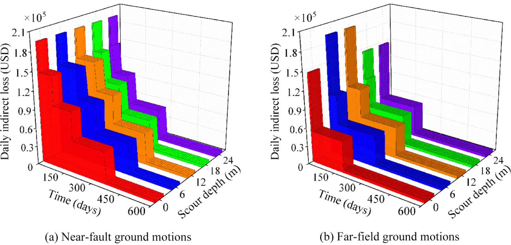  

Fig. 12. Daily indirect economic loss of CSBs at IM = 0.8 g.  

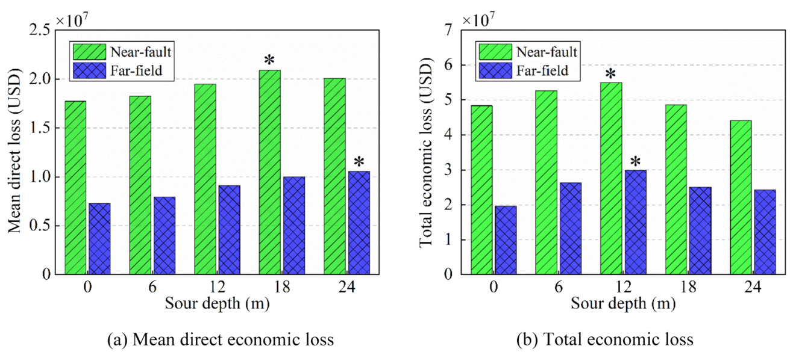  
Fig. 13.  Comparison of the economic loss of CSBs at   $\mathbf{IM}=0.8\;\mathrm{g}$  

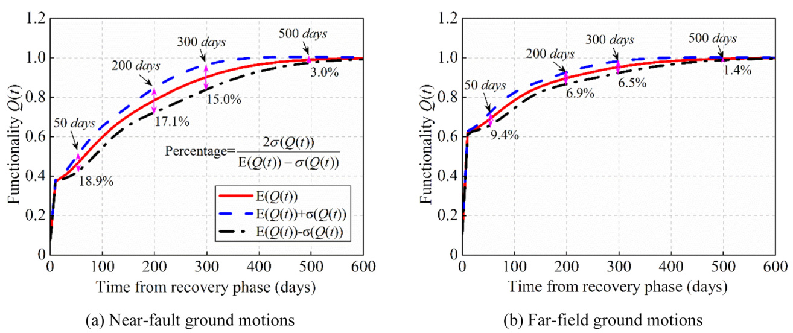  
Fig. 14.  Time-varying functionality recovery and bounds of CSBs at   $\mathbf{IM}=0.8\;\mathrm{g}$  

  
Fig. 15.  Probability density functions of CSB functionality at various time points at   $\mathbf{IM}=0.8\;\mathrm{g}$  

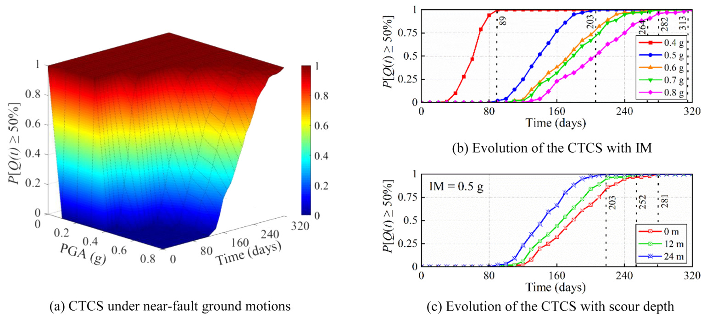  
Fig. 16.  CTCS of unscoured case CSBs for at least half-lane opening mode.  

increase. Evaluating bridge system fragility, rather than just  focusing on specific components, is crucial for accurately  assessing CSB performance. The rate of decrease in fragility rea­ ches  $16\;\%$   when solely considering bearings at identical PGAs and  scour depths.  

(2) The fragilities of CSBs for different DSs exhibit greater sensitivity  to PGA than scour depths. PGA also yields higher damage prob­ abilities than scour effects. Neglecting scour effects could lead to  misestimating the anti-collapse performance of CSBs. CSBs with a   ${\displaystyle12~\mathrm{m}}$   scour depth exhibit the largest exceedance probability   $(84.83\,\%)$   at  $\mathbf{M}=0.8\;\mathrm{g}$   for near-fault ground motions, whereas  those with a scour depth of  $24\;\mathrm{m}$   display a minimum exceedance  probability of   $64.58\;\%,$  , indicating a decline of  $23.87\ \%$  .  

(3) CSB systems exhibit increased multihazard fragility, decreased  resilience, and increased economic losses under near-fault  ground motions. At  $\mathbf{IM}=0.8\;\mathrm{g}$  , the nonmonotonic multihazard  resilience values reach a maximum percentage change of   $32;\%$  for DS3 considering CSB systems with various scour depths under  near-fault ground motions. Additionally, bidirectional fragility,  

resilience, and economic losses should be recommended to  maintain high precision in engineering practice.   (4) The functional recovery process of CSBs subjected to near-fault  ground motions displays obvious discrete behavior. Hence, inte­ grating parameter uncertainties into probabilistic resilience and  economic loss functions offers valuable insights for posthazard  traffic reopening decisions in near-fault zones.   (5) The posthazard traffic access mode of CSBs with various PGAs,  scour depths, and repair times can be rapidly and efficiently  determined through the proposed CTCS approach, facilitating the  rapid assessment of posthazard bridge-network traffic capacities.  

This paper endeavors to introduce a comprehensive framework for  the evaluation of multihazard fragility, resilience, and economic loss in  CSBs subjected to combined earthquake-scour hazards. It is imperative  to acknowledge that CSBs are integral components within a larger  network, and the investigation presented here should be integrated into  the broader context of multihazard analyses within a traffic network.  Our future research aims to expand from the component level (CSB) to  the system level (traffic network) to thoroughly explore multihazard  damage and evaluate the postdisaster resilience of traffic networks  under multiple hazards.  

# CRediT authorship contribution statement  

Guo-Yi Wu:  Writing - original draft, Software, Methodology,  Investigation, Formal analysis, Data curation.  Chun-Guang Liu:  Conceptualization, Formal analysis, Writing - review  &  editing, Funding  acquisition.  Zhi-Qian Dong:  Conceptualization, Investigation, Formal  analysis, Validation, Writing - review  &  editing, Funding acquisition.  Hui-Dong Liu:  Visualization, Writing - review  &  editing.  Faizan Ali:  Visualization, Writing - review  &  editing.  

# Declaration of Competing Interest  

The authors declare that they have no known competing financial  interests or personal relationships that could have appeared to influence  the work reported in this paper.  

# Data Availability  

Data will be made available on request.  

# Acknowledgments  

Funding for the authors was provided by the National Natural Sci­ ence Foundation of China (Grant No. 51678107) and the Open Project  Program of Guangdong Provincial Key Laboratory of Intelligent Disaster  Prevention and Emergency Technologies for Urban Lifeline Engineering  (2023ZB10). The opinions, findings, and conclusions expressed in this  paper are those of the authors and do not necessarily reflect the views of  those acknowledged here.  

#  

[1]  Zhong J, Jeon J-S, Ren W-X. Risk assessment for a long-span cable-stayed bridge  subjected to multiple support excitations. Eng Struct 2018;176:220 – 30 . 

 [2]  Lin K, Xu Y, Lu X, Guan Z, Li J. Collapse prognosis of a long-span cable-stayed  bridge based on shake table test and nonlinear model updating. Earthq Eng Struct  Dyn 2021;50:455 – 74 . 

 [3]  Franchini A, Sebastian W, D ’ Ayala D. Surrogate-based fragility analysis and  probabilistic optimisation of cable-stayed bridges subject to seismic loads. Eng  Struct 2022;256 . 

 [4]  Guo X, Zhang C, Chen Z. Nonlinear dynamic response and assessment of bridges  under barge impact with scour depth effects. J Perform Constr Facil 2020;34:  04020058 . 

 [5] Kappes, Keiler M., Glade T. From single- to multi-hazard risk analyses: a concept  addressing emerging challenges. 2010. 

 [6] Lee G.C., Mohan S.B., Huang C., Fard B.N. A study of U.S. bridge failures, Buffalo,  NY: University of Buffalo; 2013. Technical Report No. MCEER-13 – 0008. 

 [7]  Zha Y, Zhang Y, Yu X, Lu J. Numerical analysis of local scour around complex piers  for a sea-crossing bridge. Port Waterw Eng 2009:97 – 102 . 

 [8]  Alipour A, Shafei B, Shinozuka M. Reliability-based calibration of load and  resistance factors for design of rc bridges under multiple extreme events: scour and  earthquake. J Bridge Eng 2013;18:362 – 71 . 

 [9]  Wang Z, Due nas-Osorio L, Padgett JE. Influence of scour effects on the seismic  response of reinforced concrete bridges. Eng Struct 2014;76:202 – 14 . 

 [10]  Guo X, Wu Y, Guo Y. Time-dependent seismic fragility analysis of bridge systems  under scour hazard and earthquake loads. Eng Struct 2016;121:52 – 60 . 

 [11]  Wang Z, Padgett JE, Due nas-Osorio L. Risk-consistent calibration of load factors for  the design of reinforced concrete bridges under the combined effects of earthquake  and scour hazards. Eng Struct 2014;79:86 – 95 . 

 [12]  Wang X, Ye A, Ji B. Fragility-based sensitivity analysis on the seismic performance  of pile-group-supported bridges in liquefiable ground undergoing scour potentials.  Eng Struct 2019;198:109427 . 

 [13]  Bozyigit B. Seismic response of pile supported frames using the combination of  dynamic stiffness approach and Galerkin ’ s method. Eng Struct 2021;244:112822 . 

 [14]  Bozyigit B. Earthquake response of linear-elastic arch-frames using exact curved  beam formulations. Eng Comput 2022;39:792 – 812 . 

 [15]  Bozyigit B, Acikgoz S. Determination of free vibration properties of masonry arch  bridges using the dynamic stiffness method. Eng Struct 2022;250:113417 . 

 [16]  Wei K, He H, Zhang J, Yang C, Qin S. An endurance time method-based fragility  analysis framework for cable-stayed bridge systems under scour and earthquake.  Ocean Eng 2021;232:109128 .  

[17]  Akhoondzade V, Bargi K, Heidary-Torkamani H. Seismic fragility assessment of  cable-stayed bridge using incremental dynamic analysis and uniform design  method. Int J Earthq Eng Hazard Mitig 2014;2:80 – 8 . 

 [18]  Pang YT, Wu X, Shen GY, Yuan WC. Seismic fragility analysis of cable-stayed  bridges considering different sources of uncertainties. J Bridge Eng 2014;19 . 

 [19]  Council NR. National earthquake resilience: research, implementation, and  outreach. Washington, DC: The National Academies Press; 2011 . 

 [20] Washington DTWH. PPD-21. Presidential policy directive/PPD-21-critical  infrastructure security and resilience. 2013. 

 [21]  Alipour A, Shafei B. Seismic resilience of transportation networks with  deteriorating components. J Struct Eng 2016;142:C4015015 . 

 [22]  Franchin P, Cavalieri F. Probabilistic assessment of civil infrastructure resilience to  earthquakes. Comput-Aided Civ Infrastruct Eng 2015;30:583 – 600 . 

 [23]  Zhang Z, Ji T, Wei H-H. Dynamic emergency inspection routing and restoration  scheduling to enhance the post-earthquake resilience of a highway-bridge network.  Reliab Eng Syst Saf 2022;220 . 

 [24]  Chandrasekaran S, Banerjee S. Retrofit optimization for resilience enhancement of  bridges under multihazard scenario. J Struct Eng 2016;142:C4015012 . 

 [25]  Qian J, Zheng Y, Dong Y, Wu H, Guo H, Zhang J. Sustainability and resilience of  steel-shape memory alloy reinforced concrete bridge under compound earthquakes  and functional deterioration within entire life-cycle. Eng Struct 2022;271 . 

 [26]  Badroddin M, Chen Z. Lifetime resilience measurement of river-crossing bridges  with scour countermeasures under multiple hazards. J Eng Mech 2021;147 . 

 [27]  Pang Y, Wei K, He H, Wang W. Assessment of lifetime seismic resilience of a long-  span cable-stayed bridge exposed to structural corrosion. Soil Dyn Earthq Eng  2022;157 . 

 [28]  Modica A, Stafford PJ. Vector fragility surfaces for reinforced concrete frames in  Europe. Bull Earthq Eng 2014;12:1725 – 53 . 

 [29]  Cornell CA, Jalayer F, Hamburger RO, Foutch DA. Probabilistic basis for 2000 SAC  federal emergency management agency steel moment frame guidelines. J Struct  Eng 2002;128:526 – 33 . 

 [30]  Choi E, DesRoches R, Nielson B. Seismic fragility of typical bridges in moderate  seismic zones. Eng Struct 2004;26:187 – 99 . 

 [31]  Dong Y, Frangopol DM, Saydam D. Time-variant sustainability assessment of  seismically vulnerable bridges subjected to multiple hazards. Earthq Eng Struct  Dyn 2013;42:1451 – 67 . 

 [32] ATC (Applied Technology Council). 1999. Earthquake damage evaluation data for  California. Rep. No. ATC-13. Redwood City, CA: ATC. 

 [33] FEMA (Federal Emergency Management Agency). 2011. Multi-hazard loss  estimation methodology: Earthquake model Hazus-MH MR5 technical manual.  Washington, DC: FEMA. 

 [34]  Bocchini P, Frangopol Dan M, Ummenhofer T, Zinke T. Resilience and  sustainability of civil infrastructure: toward a unified approach. J Infrastruct Syst  2014;20:04014004 . 

 [35]  Zheng Y, Dong Y. Performance-based assessment of bridges with steel-SMA  reinforced piers in a life-cycle context by numerical approach. Bull Earthq Eng  2019;17:1667 – 88 . 

 [36]  Zheng Y, Dong Y, Li Y. Resilience and life-cycle performance of smart bridges with  shape memory alloy (SMA)-cable-based bearings. Constr Build Mater 2018;158:  389 – 400 . 

 [37]  Dong Y, Frangopol DM. Risk and resilience assessment of bridges under mainshock  and aftershocks incorporating uncertainties. Eng Struct 2015;83:198 – 208 . 

 [38]  Wen YK, Kang YJ. Minimum building life-cycle cost design criteria. I:  Methodology. J Struct Eng 2001;127:330 – 7 . 

 [39]  Biondini F, Camnasio E, Titi A. Seismic resilience of concrete structures under  corrosion. Earthq Eng Struct Dyn 2015;44:2445 – 66 . 

 [40]  Cimellaro GP, Reinhorn AM, Bruneau M. Framework for analytical quantification  of disaster resilience. Eng Struct 2010;32:3639 – 49 . 

 [41]  Dec o A, Bocchini P, Frangopol DM. A probabilistic approach for the prediction of  seismic resilience of bridges. Earthq Eng Struct Dyn 2013;42:1469 – 87 . 

 [42]  Li C, Wu G-Y, Li L-X, Liu C-G, Li H-N, Han Q. A comprehensive performance  evaluation methodology for sea-crossing cable-stayed bridges under wind and  wave loads. Ocean Eng 2023;280:114816 . 

 [43]  Li C, Li H-N, Hao H, Bi K, Chen B. Seismic fragility analyses of sea-crossing cable-  stayed bridges subjected to multi-support ground motions on offshore sites. Eng  Struct 2018;165:441 – 56 . 

 [44]  Xie W, Sun L. Experimental and computational assessment of shear beams as  earthquake resilient measure for double-column piers supported by pile-group. Eng  Struct 2021;242:112509 . 

 [45]  Sun L, Xie W. Evaluation of pile-soil-structure interaction effects on the seismic  responses of a super long-span cable-stayed bridge in the transverse direction: a  shaking table investigation. Soil Dyn Earthq Eng 2019;125:105755 . 

 [46]  Xie W, Sun L. Assessment and mitigation on near-fault earthquake wave effects on  seismic responses and pile-soil interactions of soil-pile-bridge model. Soil Dyn  Earthq Eng 2021;143:106596 . 

 [47]  Xie W, Sun L. Transverse seismic response and failure mode of towers of a cable-  stayed bridge full-model: Tests and simulations. Eng Fail Anal 2021;122:105224 . 

 [48]  Xie W, Sun L, He T. Evaluation on influences of inertial mass on seismic responses  and structure-soil interactions of pile-soil-piers. Bull Earthq Eng 2021;19:3523 – 50 . 

 [49]  Sun L, Xie W. Experimental assessment of soil – structure interaction effects on a  super long-span cable-stayed-bridge with pile group foundations. Bull Earthq Eng  2019;17:3169 – 96 . 

 [50] API, 1993. Recommended practice for planning, design and constructing fixed  offshore platforms. American Petroleum Institute. 

 [51]  Matlock H. Correlation for design of laterally loaded piles in soft clay. Offshore  Technol Conf 1970 .  

[52] O ’ Neil M.W., Reese L.C. Drilled Shafts: Construction Procedures and Design  Methods. 1999. 

 [53]  Bozyigit B, Bozyigit I, Prendergast LJ. Analytical approach for seismic analysis of  onshore wind turbines considering soil-structure interaction. Structures 2023;51:  226–41. 

[54]  Morison JR, Johnson JW, Schaaf SA. The force exerted by surface waves on piles.  J Pet Technol 1950;2:149 – 54 . 

 [55]  Olsson A, Sandberg G, Dahlblom O. On Latin hypercube sampling for structural  reliability analysis. Struct Saf 2003;25:47 – 68 . 

 [56]  Pan Y, Agrawal AK, Ghosn M. Seismic Fragility of Continuous Steel Highway  Bridges in New York State. J Bridge Eng 2007;12:689 – 99 . 

 [57]  Xiang N, Alam MS. Displacement-based seismic design of bridge bents retrofitted  with various bracing devices and their seismic fragility assessment under near-fault  and far-field ground motions. Soil Dyn Earthq Eng 2019;119:75 – 90 .  

[58]  Zhang J, Huo Y. Evaluating effectiveness and optimum design of isolation devices  for highway bridges using the fragility function method. Eng Struct 2009;31:  1648 – 60 . 

 [59]  Ye L, Wang Y, Xie W. Seismic fragility and loss assessment on earthquake-resilient  double-column tall piers with shear links subjected to far-field and near-fault  ground motions. Structures 2022;45:1774 – 87 . 

 [60]  Hong Y, Ye L, Xie W. Seismic fragility and resilience improvement of conventional  bridges supported by double-column piers utilizing shear links. Structures 2023;57:  105309 . 

 [61]  Zhang B. Influence of foundation constraints on dynamic effects of large-scale sea-  crossing cable-stayed bridges [D]. Dalian University of Technology 2022 . 

 [62]  Zeng C, Jiang H, Song G, Ren Y, Xue Z. Nonlinear seismic responses of a long-span  railway suspension bridge crossing strike-slip fault rupture zones. Soil Dyn Earthq  Eng 2024;177:108388 .  